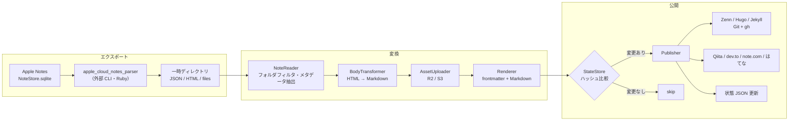

# design.md — note2web

requirements.md(以下「要件」)に基づく設計書。要件の FR / NFR 番号を参照する。

## 1. 設計方針

- **パイプライン構成**: 「エクスポート → 変換 → 公開」を単方向のパイプラインとして実装する(FR-31)。各段は前段の出力のみに依存し、状態を共有しない
- **Publisher の抽象化**: 配信先ごとの差異は Publisher インターフェースの実装に閉じ込める。Git リポジトリ出力(Zenn / Hugo / Jekyll)は共通基盤 + サービス別の frontmatter・パス規約のみ差し替える
- **外部ツールはサブプロセス**: `apple_cloud_notes_parser`・`gh`・`@qiita/qiita-cli`・`noet` はすべて外部 CLI として呼び出す。ライブラリとしてリンクしない
- **失敗の局所化**: 1ノートの失敗が実行全体を止めない。失敗したノートは状態を更新せず、次回実行で自動的に再試行される(NFR-06)

## 2. 実装言語・ランタイム

**TypeScript(Node.js 20+)** を採用する。

- `apple_cloud_notes_parser` は gem ではなく「clone して bundler で動かすアプリケーション」であり、Ruby を選んでも in-process 利用はできず、サブプロセス呼び出しになる点は同じ
- Qiita(`@qiita/qiita-cli`)・dev.to 系ツールが npm パッケージであり、利用者の環境に Node.js がいずれにせよ必要になる
- HTML → Markdown 変換(unified / rehype-remark 系)、S3 互換クライアント(AWS SDK v3、R2 対応)、grapheme 分割(`Intl.Segmenter` 標準搭載)の各要素が揃っている
- 配布は npm(`npx note2web`)。Ruby(parser 用)は別途必要な依存としてドキュメントに明記する(NFR-05)

## 3. 全体アーキテクチャ



1回の実行は「1つの設定 YAML」に対して行う(FR-29)。複数サービスへ配信する場合は cron / launchd に設定ファイルの数だけエントリを登録する。

```
note2web sync --config ~/.config/note2web/zenn.yaml
```

## 4. 外部ツール調査結果(要件「未決事項」の解消)

設計にあたり一次情報を確認した。要件で未決としていた項目の結論:

| 未決事項 | 結論 |
|---|---|
| `apple_cloud_notes_parser` の出力形式 | HTML(表を実際の表として描画)・JSON(アカウント / フォルダ / ノートの要約、更新日時含む)・CSV・SQLite を出力。埋め込みファイル(画像・**描画**)は `files` フォルダに抽出される。UUID(`ZIDENTIFIER`)は HTML / CSV / JSON に出力可能。Markdown 出力は無い → **HTML を本文ソース、JSON をメタデータソースとする** |
| 同・チェックリストの形式 | README に言及なし → HTML 出力での表現を実装初期に実機確認する(§13) |
| 同・手書きの形式 | 描画(drawings)は埋め込みファイルとして抽出される。抽出物が画像でない場合のフォールバックは実機確認(§13) |
| はてなブログ AtomPub の Markdown 入稿 | `content type="text/x-markdown"` で入稿可能(複数の実装事例で確認。公式仕様書はネットワーク制約で未参照のため実装時に実機確認)。**ブログの編集モードが Markdown であることを利用条件とする** |
| はてなブログの認証方式 | **Basic 認証(はてな ID + API キー)を採用**。HTTPS 経由のため十分であり、実装が最も単純 |
| dev.to の方式 | **Forem API v1 を直接叩く方式を採用**。`@sinedied/devto-cli` は「GitHub リポジトリに画像をホストする」ワークフロー前提で、本ツールの R2 / S3 方式と競合するため |
| Qiita の認証 | `qiita-cli` は `qiita login` による対話登録が基本。無人実行のため、環境変数 `QIITA_TOKEN` から認証情報ファイルを生成する方式とする(生成先・形式は実装時確認、§13) |
| note.com | `noet`(kako-jun/noet)は Markdown ファイル + Hugo 風ワークスペースで記事を管理し、レート制御を内蔵。画像アップロード未対応(要件どおり) |
| Jekyll のファイル名規約 | `_posts/YYYY-MM-DD-<uuid>.md`。日付はノートの**作成日**を使う。初回配信時のファイル名を状態 JSON に記録し、以後は作成日が変わっても**記録済みファイル名を使い続ける**(URL の安定性を優先) |
| ハッシュアルゴリズム | SHA-256 |
| ログ形式・出力先 | JSON Lines を標準出力へ。設定でファイル出力を追加可能(§10) |
| 設定・状態の配置場所 | 設定: 任意パス(`--config` 必須)。推奨は `~/.config/note2web/`。状態: 既定で設定ファイルと同じディレクトリの `<設定名>.state.json`、`state_file` で変更可(§8) |
| 実装言語 | TypeScript / Node.js(§2) |
| UUID の安定性 | 保証しない前提で設計する。DB 復元等で UUID が変わった場合、旧記事はサービス側に残り(FR-18 の孤児許容と同じ扱い)、新 UUID で新規記事として配信される。制約としてドキュメントに明記 |

## 5. コンポーネント設計

### 5.1 CLI(`src/cli.ts`)

```
note2web sync --config <path>     # メインコマンド。エクスポート→変換→公開を実行
note2web doctor --config <path>   # 依存 CLI・環境変数・権限の事前チェックのみ実行
```

- `doctor` は NFR-05(依存欠如時の明確なエラー)を独立コマンドとしても提供するもの。`sync` も実行冒頭で同じチェックを行い、欠けていれば何も配信せずに失敗する
- 終了コード: 全ノート成功(スキップ含む)= 0、1件でも失敗 = 1、実行前提の不成立(設定不正・依存欠如)= 2

### 5.2 Exporter(`src/exporter/`)

`apple_cloud_notes_parser` をサブプロセスで実行し、一時ディレクトリに出力させる。

- 実行例: `ruby notes_cloud_ripper.rb -m <Notesコンテナ> -o <tmpdir>` + UUID 出力オプション
- parser のインストール先パスと Notes コンテナパスは設定 YAML の `exporter` 項目で指定(既定値あり、§8)
- 出力のうち利用するもの:
  - **JSON**: フォルダ階層、ノート一覧、UUID、作成 / 更新日時 → `Note` モデルの骨格
  - **HTML**: ノート本文(表・書式を保持)→ 本文変換の入力
  - **files/**: 添付・描画の実体 → アセットアップロードの入力
- 毎回フルエクスポートする。差分判定はエクスポート段ではなく、変換後ハッシュで行う(FR-15)ため、エクスポートの増分化は不要

### 5.3 Note モデルとメタデータ抽出(`src/model/`, `src/transform/metadata.ts`)

```ts
interface Note {
  uuid: string;          // Apple Notes の UUID（FR-09）
  folder: string;        // フォルダ名（FR-06）
  title: string;         // 1行目から先頭絵文字を除去（FR-04）
  emoji: string | null;  // 1行目の1文字目（grapheme cluster、絵文字の場合のみ）（FR-05）
  tags: string[];        // ノート内ハッシュタグ（FR-07）
  createdAt: Date;       // FR-08
  updatedAt: Date;       // FR-08
  bodyHtml: string;      // parser の HTML 出力から該当ノート部分を切り出したもの
  attachments: Attachment[];  // files/ 配下の実体への参照
}
```

- **1行目**: HTML 中の最初のブロック要素のテキストとする
- **絵文字判定**: `Intl.Segmenter` で先頭 grapheme を取得し、`\p{Extended_Pictographic}` にマッチする場合のみ絵文字として扱う。絵文字だった場合、タイトルは先頭 grapheme と直後の空白を除去した残り
- **ハッシュタグ**: 本文テキスト中の `#タグ` パターンを抽出する。**ハッシュタグのみで構成される行**(タグ置き場として末尾に置かれる行)は本文から除去し、文中に現れるものは本文に残す

### 5.4 BodyTransformer(`src/transform/`)

HTML → Markdown 変換。unified(rehype-parse → rehype-remark → remark-stringify + remark-gfm)を使用。

| 入力(HTML) | 出力(Markdown) | 要件 |
|---|---|---|
| `<table>` | GFM の表 | FR-11 |
| チェックリスト(表現は実機確認) | `- [ ]` / `- [x]` | FR-12 |
| 描画への参照 | 画像参照 `` | FR-13 |
| 添付への参照 | アセット URL(画像は ``、それ以外はリンク) | FR-14 |
| 見出し・リスト・強調等 | 対応する Markdown | FR-10 |

- 1行目(タイトル行)は本文から除去する(タイトルは frontmatter へ)
- 変換で表現できない要素は、HTML のまま埋め込まず**テキスト化して警告ログ**を出す(サービス側での生 HTML の扱いが不定のため)

### 5.5 AssetUploader(`src/assets/`)

- AWS SDK v3(S3 互換)で R2 / S3 に対応。R2 は `endpoint` 指定で切り替え
- キー: `<prefix><content-hashの先頭2文字>/<content-hash>.<拡張子>`(FR-17)。content hash はファイル実体の SHA-256
- アップロード前に状態 JSON の `assets` を引き、既知の hash はスキップ(FR-17)
- 本文中の参照は `public_base_url` + キー に差し替える(FR-14)
- 手書き描画は parser が抽出した画像ファイルをそのまま同じ経路でアップロードする(FR-13)

### 5.6 Renderer と冪等判定(`src/transform/frontmatter.ts`, `src/state/`)

- サービス別の frontmatter(§9)+ 変換済み Markdown 本文を連結した**最終成果物の文字列**に対して SHA-256 を取る。これが「コンテンツハッシュ」(FR-15)
- frontmatter に実行時刻など毎回変わる値を**入れない**こと(冪等性が壊れるため)。日付はノートの作成 / 更新日時のみ使用する
- StateStore は状態 JSON(§8)の読み書きを担う。書き込みは「一時ファイルに書いて rename」のアトミック更新とし、ノート1件の配信成功ごとに保存する(途中クラッシュで成功済み分が失われないように)

### 5.7 Publisher(`src/publishers/`)

```ts
interface Publisher {
  // 変更のあったノートを配信し、サービス側の識別子等を返す
  publish(a: RenderedArticle, prev: NoteState | null): Promise<PublishResult>;
  // Git モードのみ: 全ノート処理後のコミット・PR 作成
  finalize?(): Promise<void>;
}
```

#### GitRepoPublisher(Zenn / Hugo / Jekyll 共通基盤)

1. 実行開始時に `repo_path` で `git fetch` → `base_branch` から作業ブランチ `note2web/sync-<実行開始時刻>` を作成(FR-19)
2. `publish()` は変更のあったノートのファイルを規約パス(§9)へ書き込むだけ
3. `finalize()`:
   - `git status` で差分ゼロなら、ブランチを削除して終了。コミットも PR も作らない(FR-22)
   - 差分があればコミット・`git push` し、`gh pr create` で PR 作成(FR-20)
   - `auto_merge: true` なら `gh pr merge --merge --delete-branch` を実行(FR-21)。ブランチ保護等でマージ不能なら PR を残したまま失敗として報告
4. 状態 JSON のハッシュ更新は **PR 作成成功時点**で確定する(マージ待ちの間に再実行されても同内容のブランチが乱立しないように)。auto_merge なしで PR がクローズされた場合、その内容は再配信されない(次にノートが変更されるまで)。この挙動は README に明記する

サービス別差分:

| | ファイルパス | frontmatter | 備考 |
|---|---|---|---|
| Zenn | `articles/<uuid小文字>.md` | `title` / `emoji` / `type` / `topics` / `published: true` | slug = UUID 小文字化(FR-23)。`type` はフォルダ名。`tech` / `idea` 以外のフォルダ名なら設定不正としてそのノートを失敗扱い(FR-24)。絵文字が無いノートは既定値 `📝`(Zenn は emoji 必須のため) |
| Hugo | `<output_dir>/<uuid>.md` | `title` / `date`(作成日時)/ `lastmod`(更新日時)/ `categories: [フォルダ名]` / `tags` | `output_dir` は設定で指定(例 `content/posts`) |
| Jekyll | `_posts/YYYY-MM-DD-<uuid>.md` | `title` / `date` / `categories` / `tags` | 日付は作成日。初回のファイル名を状態に記録し固定(§4) |

#### QiitaPublisher

- 設定で指定した qiita-cli ワークスペースに `public/<uuid>.md` を書き、`npx qiita publish <uuid>` を実行(FR-25)
- frontmatter: `title` / `tags` / `private: false` / `id`(初回は `null`、qiita-cli が投稿後に書き戻す ID を読み取って状態 JSON に保存)
- タグ制約(1〜5個必須、スペース不可)への対処:
  - 半角スペースを含むタグは**除外**し警告ログ(分割送信による 403 を防ぐ)
  - 除外後 6個以上なら先頭5個に切り詰めて警告ログ
  - 除外後 0個ならそのノートは**失敗扱い**(エラーログ。タグを付けて再実行してもらう)
- 認証: `QIITA_TOKEN` 環境変数(FR-30)

#### DevtoPublisher

- Forem API v1 を直接呼ぶ(FR-26)。新規 `POST /api/articles`、更新 `PUT /api/articles/{id}`(ID は状態 JSON から)
- `tags` は先頭4個に切り詰め(超過時は警告ログ)。`canonical_url` は設定にベース URL がある場合のみ付与
- 認証: `api-key` ヘッダ。値は環境変数(既定 `DEVTO_API_KEY`)

#### NotePublisher

- `noet` のワークスペースに Markdown を書き、`noet` の公開コマンドを実行(FR-27)。コマンド体系・記事 ID の受け渡しは実装初期に確認(§13)
- 画像は R2 / S3 の公開 URL 参照のまま送る(noet は画像アップロード未対応)。note.com 側での外部画像の扱いは残リスク(§13)

#### HatenaPublisher

- AtomPub(FR-28)。新規 `POST <blog>/atom/entry`、更新 `PUT <blog>/atom/entry/<entry_id>`(entry_id は状態 JSON から)
- `content type="text/x-markdown"` で Markdown 本文をそのまま入稿。`<category term="フォルダ名"/>`、タグもはてなではカテゴリとして表現されるため `category` 要素で送る
- 認証: Basic(はてな ID + API キー)。API キーは環境変数(既定 `HATENA_API_KEY`)

## 6. 処理フロー

```
sync:
  1. 設定 YAML 読み込み・検証(環境変数の存在チェック含む)
  2. 依存チェック(ruby / parser / 各サービスの CLI / gh)         … 失敗なら exit 2
  3. Exporter 実行 → 一時ディレクトリ
  4. JSON からノート一覧を構築、設定の folders でフィルタ(FR-02)
  5. Git モードなら作業ブランチ作成
  6. 各ノートについて（1件ずつ、失敗は隔離）:
     a. メタデータ抽出 → 本文変換
     b. アセット: 状態 JSON に無い hash のみアップロード
     c. frontmatter + 本文をレンダリング → SHA-256
     d. 状態 JSON の content_hash と一致 → skip をログして次へ
     e. 不一致 → Publisher.publish()
     f. 成功 → 状態 JSON 更新・保存、published/updated をログ
        失敗 → 状態は触らず failed をログ（次回再試行）
  7. Git モード: finalize()（差分ゼロならブランチ破棄）
  8. 一時ディレクトリ削除、サマリログ、終了コード決定
```

- 同一ノートの二重処理を避けるため、状態 JSON と同じ場所にロックファイルを置き、多重起動時は即座に exit 2(cron の実行間隔より処理が長引いた場合の保護)

## 7. 設定 YAML スキーマ

```yaml
# 共通部
service: zenn                  # zenn | hugo | jekyll | qiita | devto | note | hatena
source:
  folders: [tech, idea]        # 配信対象フォルダ（FR-02）。Zenn ではフォルダ名が type になる
exporter:
  parser_path: ~/tools/apple_cloud_notes_parser   # clone 先
  notes_container: ~/Library/Group Containers/group.com.apple.notes  # 既定値
state_file: ./zenn.state.json  # 省略時: <設定ファイル名>.state.json
log:
  file: ~/Library/Logs/note2web/zenn.log   # 省略可。標準出力へは常に出す
assets:
  provider: r2                 # r2 | s3
  bucket: blog-assets
  endpoint: https://<account>.r2.cloudflarestorage.com   # r2 のとき必須
  region: auto
  prefix: notes/
  public_base_url: https://assets.example.com/notes/
  access_key_id_env: R2_ACCESS_KEY_ID       # 環境変数名を書く。値は書かない（FR-30）
  secret_access_key_env: R2_SECRET_ACCESS_KEY

# --- Git 出力モード（zenn / hugo / jekyll）のみ ---
git:
  repo_path: ~/src/zenn-content
  base_branch: main
  output_dir: articles         # hugo/jekyll で使用。zenn は articles 固定
  auto_merge: true             # FR-21

# --- サービス固有（該当 service のときのみ）---
qiita:
  workspace: ~/src/qiita-content
  token_env: QIITA_TOKEN
devto:
  api_key_env: DEVTO_API_KEY
  canonical_base_url: https://example.com/articles/   # 省略可
note:
  workspace: ~/src/note-content
hatena:
  hatena_id: example
  blog_id: example.hatenablog.com
  api_key_env: HATENA_API_KEY
```

- 秘匿情報のキーはすべて `*_env`(環境変数名)であり、値の直書きはスキーマ検証で拒否する(FR-30)
- 検証には JSON Schema(zod 等)を使い、不正時はどのキーが問題かを明示して exit 2

## 8. 状態 JSON スキーマ

設定ファイルごとに1つ(FR-16)。

```json
{
  "version": 1,
  "service": "zenn",
  "notes": {
    "5c1c2c3d-…-uuid": {
      "contentHash": "sha256:ab12…",
      "remoteId": "qiita の記事ID / dev.to の id / はてなの entry_id。Git モードでは null",
      "url": "サービス側 URL（取得できる場合）",
      "artifactPath": "articles/5c1c2c3d-….md（Git モード。Jekyll のファイル名固定にも使用）",
      "firstPublishedAt": "2026-08-11T00:00:00+09:00",
      "lastPublishedAt": "2026-08-11T00:00:00+09:00"
    }
  },
  "assets": {
    "ab12cd…(content hash)": {
      "key": "notes/ab/ab12cd….png",
      "url": "https://assets.example.com/notes/ab/ab12cd….png",
      "uploadedAt": "2026-08-11T00:00:00+09:00"
    }
  }
}
```

- `version` はスキーマ移行用。読み込み時に未知の version なら exit 2
- ノートの削除・移動時もエントリは削除しない(FR-18。単に参照されなくなるだけ)

## 9. ログ設計(NFR-01)

JSON Lines。1行1イベント。標準出力へ常時、設定があればファイルにも追記。

```json
{"ts":"2026-08-11T09:00:00+09:00","level":"info","event":"note_published","service":"zenn","noteUuid":"5c1c…","title":"…","result":"updated","url":"…"}
```

| event | 意味 |
|---|---|
| `run_start` / `run_end` | 実行の開始 / 終了(run_end に成功・スキップ・失敗の件数サマリ) |
| `export_done` | エクスポート完了(ノート件数) |
| `note_published` | 配信成功(`result`: `created` / `updated`) |
| `note_skipped` | ハッシュ一致で配信不要 |
| `note_failed` | 配信失敗(`error` にメッセージ) |
| `asset_uploaded` | アセットアップロード |
| `warn` 系 | タグ切り詰め、表現できない要素のテキスト化等 |

「何を(noteUuid / title)・いつ(ts)・どのサービスに(service)・成否(event / result)」がこの1行で追える。

## 10. エラーハンドリング

| 障害 | 挙動 |
|---|---|
| 設定不正・環境変数未設定・依存 CLI 欠如 | 何も配信せず exit 2(NFR-03/05) |
| parser の実行失敗 | 実行全体を中断、exit 1(以降の判定材料が無いため) |
| 個別ノートの変換・配信失敗 | そのノートのみ failed、状態未更新、処理続行(NFR-06) |
| アセットアップロード失敗 | そのノートを failed 扱い(URL 未確定の本文を配信しない) |
| `gh pr merge` 失敗(保護ルール等) | PR は残し、実行は失敗として報告 |
| 多重起動 | ロックファイル検出で即 exit 2 |

## 11. リポジトリ構成(本体)

```
note2web/
  src/
    cli.ts  config.ts  logger.ts  lock.ts
    exporter/apple-notes.ts
    model/note.ts
    transform/{metadata,html-to-markdown,frontmatter}.ts
    assets/uploader.ts
    state/store.ts
    publishers/{base,git-repo,zenn,hugo,jekyll,qiita,devto,note,hatena}.ts
  test/
    fixtures/        # parser 出力（HTML/JSON）のサンプル
  requirements.md  design.md  README.md
```

## 12. テスト方針

- **ユニット**: メタデータ抽出(grapheme / 絵文字判定・ハッシュタグ行の除去)、HTML→Markdown(表・チェックリスト)、frontmatter 生成、ハッシュの安定性(同一入力 → 同一ハッシュ)、タグ制約の切り詰めロジック
- **結合**: parser の実出力を fixture 化し、エクスポート以降を通しで検証。Publisher は外部呼び出し(git / gh / HTTP / CLI)をモック化
- **実機確認**(CI 不能なもの): parser のチェックリスト / 描画出力、qiita-cli の無人認証、noet の公開フロー、はてな AtomPub の Markdown 入稿。§13 の項目と対応

## 13. 実装時に確認が必要な残課題

1. parser の HTML 出力における**チェックリストの表現**(→ rehype-remark の変換ルールを確定)
2. parser が抽出する**描画ファイルの形式**(画像でない場合の画像化手段)
3. `qiita-cli` を **`QIITA_TOKEN` 環境変数だけで無人実行**する方法(認証情報ファイルの生成先・形式)
4. `noet` の公開コマンド体系・記事 ID の取得方法・認証方法
5. はてなブログ AtomPub の `text/x-markdown` 入稿の実機確認(一次資料未参照。複数の実装事例では動作)
6. note.com が本文中の**外部画像 URL(R2 / S3)をどう扱うか**
7. parser の JSON スキーマの詳細(フォルダ階層・作成日時のフィールド名)

いずれも該当 Publisher / Transformer 内部に閉じており、確認結果によってアーキテクチャは変わらない。
