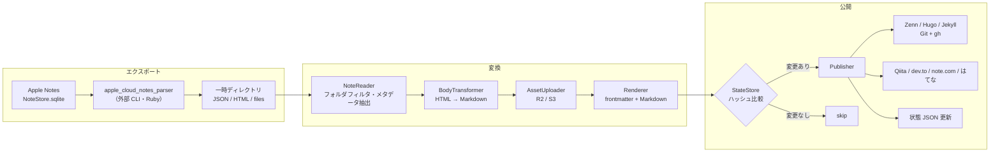

# design.md — note2web

requirements.md(以下「要件」)に基づく設計書。要件の FR / NFR 番号を参照する。

## 1. 設計方針

- **パイプライン構成**: 「エクスポート → 変換 → 公開」を単方向のパイプラインとして実装する(FR-31)。各段は「前段の出力」と、唯一の副作用ポートである **StateStore** のみに依存する。StateStore は実行開始時にディスクから状態を1回だけ読み込み、以後は自身の書き込みを反映した一貫ビューを全段に提供する(AssetUploader の既アップロード判定、Publisher への `prev: NoteState` 受け渡しはこのビューから行う)。書き込みは「アセットアップロード成功時」と「ノート配信の確定時」の2箇所に限定する(§5.6)
- **Publisher の抽象化**: 配信先ごとの差異は Publisher インターフェースの実装に閉じ込める。Git リポジトリ出力(Zenn / Hugo / Jekyll)は共通基盤 + サービス別の frontmatter・パス規約のみ差し替える
- **外部ツールはサブプロセス**: `apple_cloud_notes_parser`・`gh`・`@qiita/qiita-cli`・`noet` はすべて外部 CLI として呼び出す。ライブラリとしてリンクしない
- **失敗の局所化**: 1ノートの失敗が実行全体を止めない。失敗したノートは状態を更新せず、次回実行で自動的に再試行される(NFR-06)

## 2. 実装言語・ランタイム

**TypeScript(Node.js 20+)** を採用する。

- `apple_cloud_notes_parser` は gem ではなく「clone して bundler で動かすアプリケーション」であり、Ruby を選んでも in-process 利用はできず、サブプロセス呼び出しになる点は同じ
- Qiita(`@qiita/qiita-cli`)・dev.to 系ツールが npm パッケージであり、利用者の環境に Node.js がいずれにせよ必要になる
- HTML → Markdown 変換(unified / rehype-remark 系)、S3 互換クライアント(AWS SDK v3、R2 対応)、grapheme 分割(`Intl.Segmenter` 標準搭載)の各要素が揃っている
- 配布は npm(`npx note2web`)。Ruby(parser 用)は別途必要な依存としてドキュメントに明記する(NFR-05)

## 3. 全体アーキテクチャ



1回の実行は「1つの設定 YAML」に対して行う(FR-29)。複数サービスへ配信する場合は cron / launchd に設定ファイルの数だけエントリを登録する。

```
note2web sync --config ~/.config/note2web/zenn.yaml
```

## 4. 外部ツール調査結果(要件「未決事項」の解消)

設計にあたり一次情報を確認した。要件で未決としていた項目の結論:

| 未決事項 | 結論 |
|---|---|
| `apple_cloud_notes_parser` の出力形式 | HTML(表を実際の表として描画)・JSON(アカウント / フォルダ / ノートの要約、更新日時含む)・CSV・SQLite を出力。埋め込みファイル(画像・**描画**)は `files` フォルダに抽出される。UUID(`ZIDENTIFIER`)は HTML / CSV / JSON に出力可能で、`--individual-files` によるノート単位の HTML 出力と `--uuid` による UUID ベースの命名に対応。Markdown 出力は無い → **HTML を本文ソース、JSON をメタデータソースとする**(対応規約は §5.2)。**確認方法**: パーサ(commit `4754a2b`)を clone し、同梱の実エクスポート blob(`spec/data/exported_blobs/*.bin`)に対して実コード(`AppleNote#generate_html` 等)を実行し、`lib/` のソースと同梱 `JSON.md` を突き合わせて確認した。macOS 実機での `NoteStore.sqlite` に対するエンドツーエンド実行は未実施(§13 冒頭の注記、および `test/fixtures/parser-output/README.md` 参照) |
| 同・チェックリストの形式 | **確認済み(§13-1 解消)**。`<ul class="checklist" data-apple-notes-indent-amount="N">` の下に `<li class="checked">` / `<li class="unchecked">` が並ぶ(ネストは `li` の中に入れ子の `ul.checklist` を置く形)。実データ blob (`list_indents_gzipped.bin`) をパーサの実コードで実行して確認済み。詳細は §13 |
| 同・手書きの形式 | **確認済み(§13-2 解消)**。描画(`com.apple.drawing.2` / `com.apple.drawing` / `com.apple.paper`)は `files/Accounts/<アカウント UUID>/FallbackImages/<UUID>/...` にラスター画像(png/jpg/jpeg。実体は Apple 側が生成する「フォールバック画像」)として抽出され、ベクターデータそのものは出力されない。本文には `<a href="…"></a>` が挿入される。ソースコード読解により確認(exported_blobs に手書きの実データが無いため実行検証は未実施)。詳細は §13 |
| はてなブログ AtomPub の Markdown 入稿 | `content type="text/x-markdown"` で入稿可能(複数の実装事例で確認。公式仕様書はネットワーク制約で未参照のため実装時に実機確認)。**ブログの編集モードが Markdown であることを利用条件とする** |
| はてなブログの認証方式 | **Basic 認証(はてな ID + API キー)を採用**。HTTPS 経由のため十分であり、実装が最も単純 |
| dev.to の方式 | **Forem API v1 を直接叩く方式を採用**。`@sinedied/devto-cli` は「GitHub リポジトリに画像をホストする」ワークフロー前提で、本ツールの R2 / S3 方式と競合するため |
| Qiita の認証 | `qiita-cli` は `qiita login` による対話登録が基本。無人実行のため、環境変数 `QIITA_TOKEN` から認証情報ファイルを生成する方式とする(生成先・形式は実装時確認、§13) |
| note.com | `noet`(kako-jun/noet)は Markdown ファイル + Hugo 風ワークスペースで記事を管理し、レート制御を内蔵。画像アップロード未対応(要件どおり) |
| Jekyll のファイル名規約 | `_posts/YYYY-MM-DD-<uuid>.md`。日付はノートの**作成日**を使う。初回配信時のファイル名を状態 JSON に記録し、以後は作成日が変わっても**記録済みファイル名を使い続ける**(URL の安定性を優先) |
| ハッシュアルゴリズム | SHA-256 |
| ログ形式・出力先 | JSON Lines を標準出力へ。設定でファイル出力を追加可能(§10) |
| 設定・状態の配置場所 | 設定: 任意パス(`--config` 必須)。推奨は `~/.config/note2web/`。状態: 既定で設定ファイルと同じディレクトリの `<設定名>.state.json`、`state_file` で変更可(§8) |
| 実装言語 | TypeScript / Node.js(§2) |
| UUID の安定性 | 保証しない前提で設計する。DB 復元等で UUID が変わった場合、旧記事はサービス側に残り(FR-18 の孤児許容と同じ扱い)、新 UUID で新規記事として配信される。制約としてドキュメントに明記 |

## 5. コンポーネント設計

### 5.1 CLI(`src/cli.ts`)

```
note2web sync --config <path>     # メインコマンド。エクスポート→変換→公開を実行
note2web doctor --config <path>   # 依存 CLI・環境変数・権限の事前チェックのみ実行
```

- `doctor` は NFR-05(依存欠如時の明確なエラー)を独立コマンドとしても提供するもの。`sync` も実行冒頭で同じチェックを行い、欠けていれば何も配信せずに失敗する
- 終了コード: 全ノート成功(スキップ含む)= 0、1件でも失敗 = 1、実行前提の不成立(設定不正・依存欠如)= 2

### 5.2 Exporter(`src/exporter/`)

`apple_cloud_notes_parser` をサブプロセスで実行し、一時ディレクトリに出力させる。

- 実行例: `ruby notes_cloud_ripper.rb -m <Notesコンテナ> -o <tmpdir> --individual-files --uuid`
- parser のインストール先パスと Notes コンテナパスは設定 YAML の `exporter` 項目で指定(既定値あり、§8)
- **HTML と UUID の対応規約**: `--individual-files` でノートごとの個別 HTML を出力させ、`--uuid` でファイル名・出力内の識別子を `ZIDENTIFIER`(UUID)にする。JSON 側の UUID から個別 HTML の相対パスを一意に解決できることを本文取得の前提とし、対応する HTML が見つからないノートはそのノートのみ failed 扱いにする。オプション名・出力パス形式は parser の更新で変わり得るため、複数ノートを含む fixture の結合テストで検証する(§12)
  - **具体的な対応規則(パーサのソース `lib/AppleNoteStore.rb` `write_individual_html` / `lib/AppleNote.rb` `title_as_filename` / `lib/AppleNotesFolder.rb` `to_path` を確認して確定。§13-7 と同一の確認方法)**: 出力ディレクトリは `<出力先>/html/note_store<N>/` を起点とし、その配下に `<アカウント名>-<ルートフォルダ名>/`(ルートフォルダ)→ 子フォルダはアカウント名を繰り返さずそのまま入れ子(`<親フォルダのパス>/<子フォルダ名>/`)という階層が並ぶ。各フォルダディレクトリの直下に、そのフォルダに属するノートの個別 HTML `<UUID> - <サニタイズ済みタイトル>.html` が置かれる(`file_title` は `title.tr('[\\/*"<>?|:]\'', '_')` でサニタイズ)。この「フォルダ名を辿ってノートファイルを探す」経路は JSON 側にも `folder_key` / `folder` として同じフォルダ情報があるため、**JSON の `folders` 階層(`parent_folder_id` / `child_folders`)から対象フォルダの `<アカウント名>-...` パスを再構築し、そのディレクトリ内で `<uuid> - *.html` を UUID 前方一致で探す**、という解決手順を NoteReader の実装規約とする(タイトルのサニタイズ結果を NoteReader 側で再現する必要がないようにするため)。ただし、ディレクトリ名にはアカウント名・フォルダ名そのままではなく **parser の `clean_name`(`name.tr('/:\\', '_')`。`lib/AppleNotesAccount.rb` / `lib/AppleNotesFolder.rb`)による置換後の名前**が使われるため、パス再構築時は JSON の未変換の名前に対して同じ置換(`/`・`:`・`\` → `_`)を適用すること(記号を含むフォルダ名の例は fixture の `Dev/Ops: Log` → `Sample Notes-Dev_Ops_ Log/` を参照)
  - JSON の各ノートオブジェクトが持つ `"html"` フィールド(`generate_html()` を引数省略で呼んだ結果。`individual_files: false, use_uuid: false` 相当)は、`--individual-files --uuid` で書き出される個別 HTML ファイルとは**アンカー形式・`files/` への相対パスの深さが異なる**別物であり、本文ソースとしては使わない(個別 HTML ファイルのみを本文ソースとする、という上記の規約はこの差異を踏まえたもの)
  - 添付・描画の実体は `<出力先>/files/Accounts/<アカウント UUID>/...`(端末上のパスをそのまま踏襲。フォルダの見た目上のパスとは無関係)に置かれ、個別 HTML ファイルからの相対パスの `../` の数はノートの入っているフォルダの深さに応じて変わる(ルートフォルダのノートで3階層分)。具体例は `test/fixtures/parser-output/`(§12)を参照
- 出力のうち利用するもの:
  - **JSON**: フォルダ階層、ノート一覧、UUID、作成 / 更新日時 → `Note` モデルの骨格
  - **HTML**: ノート本文(表・書式を保持)→ 本文変換の入力
  - **files/**: 添付・描画の実体 → アセットアップロードの入力
- 毎回フルエクスポートする。差分判定はエクスポート段ではなく、変換後ハッシュで行う(FR-15)ため、エクスポートの増分化は不要

### 5.3 Note モデルとメタデータ抽出(`src/model/`, `src/transform/metadata.ts`)

```ts
interface Note {
  uuid: string;          // Apple Notes の UUID（FR-09）
  folder: string;        // フォルダ名（FR-06）
  title: string;         // 1行目から先頭絵文字を除去（FR-04）
  emoji: string | null;  // 1行目の1文字目（grapheme cluster、絵文字の場合のみ）（FR-05）
  tags: string[];        // ノート内ハッシュタグ（FR-07）
  createdAt: Date;       // FR-08
  updatedAt: Date;       // FR-08
  bodyHtml: string;      // parser が出力した当該ノートの個別 HTML（UUID で解決。§5.2）
  attachments: Attachment[];  // files/ 配下の実体への参照
}
```

- **JSON フィールドとの対応(§13-7 で確定)**: `uuid` ← JSON ノートオブジェクトの `uuid`、`folder` ← 同 `folder`(フォルダ名の文字列。フォルダ階層自体が必要な場合は JSON トップレベルの `folders`(`parent_folder_id` / `child_folders` で表現される入れ子構造)を別途辿る)、`createdAt` ← `creation_time`、`updatedAt` ← `modify_time`(いずれも `"YYYY-MM-DD HH:MM:SS +0000"` 形式の文字列。固定書式のため専用パーサ不要)、`bodyHtml` ← 個別 HTML ファイル(JSON の `html` フィールドではない。§5.2 参照)
  - **差分(調査により判明)**: 当初想定していなかったが、JSON のノートオブジェクトは `hashtags`(例 `["#タグ"]`)フィールドを**パーサ自身が抽出済み**の形で持つ(`lib/AppleNote.rb` `prepare_json`。埋め込みオブジェクト中の `AppleNotesEmbeddedInlineHashtag` を機械的に収集したもの)。したがって `tags` は本文 HTML の正規表現走査ではなく、この JSON の `hashtags` を第一の情報源とする方が頑健(絵文字や記号を含むタグの誤検出を避けられる)。ただし JSON の `hashtags` は「本文中のインラインタグ」と「タグ置き場として末尾に置かれた行のタグ」を区別しない一覧に過ぎず、**本文からタグのみの行を除去するかどうかの判定(下記)は引き続き HTML 側のテキスト解析が必要**であるため、`tags` の値の取得元だけを JSON に置き換え、本文除去ロジックは変更しない
- **1行目**: HTML 中の最初のブロック要素のテキストとする
- **絵文字判定**: `Intl.Segmenter` で先頭 grapheme を取得し、`\p{Extended_Pictographic}` にマッチする場合のみ絵文字として扱う。絵文字だった場合、タイトルは先頭 grapheme と直後の空白を除去した残り
- **ハッシュタグ**: `tags` の値は JSON ノートオブジェクトの `hashtags` フィールド(parser が抽出済み。上記差分参照)のみを情報源とし、本文からの正規表現抽出は行わない。**ハッシュタグのみで構成される行**(タグ置き場として末尾に置かれる行)を本文から除去するかどうかの判定にのみ、引き続き HTML 側のテキスト解析を用いる(文中に現れるタグは本文に残す)

### 5.4 BodyTransformer(`src/transform/`)

HTML → Markdown 変換。unified(rehype-parse → rehype-remark → remark-stringify + remark-gfm)を使用。

| 入力(HTML) | 出力(Markdown) | 要件 |
|---|---|---|
| `<table>` | GFM の表 | FR-11 |
| チェックリスト: `<ul class="checklist" data-apple-notes-indent-amount="N"><li class="checked">` / `<li class="unchecked">`(§13-1 で確認済み。ネストは `li` 内の入れ子 `ul.checklist`) | `- [x]` / `- [ ]`(インデントに応じてネスト) | FR-12 |
| 描画への参照: `<a href="…">/…" data-apple-notes-zidentifier="…"></a>`(§13-2 で確認済み。実体は `files/Accounts/<アカウント UUID>/FallbackImages/…` 配下のラスター画像) | 画像参照 `` | FR-13 |
| 添付への参照 | アセット URL(画像は ``、それ以外はリンク) | FR-14 |
| 見出し・リスト・強調等 | 対応する Markdown | FR-10 |

- 1行目(タイトル行)は本文から除去する(タイトルは frontmatter へ)
- 変換で表現できない要素は、HTML のまま埋め込まず**テキスト化して警告ログ**を出す(サービス側での生 HTML の扱いが不定のため)

### 5.5 AssetUploader(`src/assets/`)

- AWS SDK v3(S3 互換)で R2 / S3 に対応。R2 は `endpoint` 指定で切り替え
- キー: `<prefix><content-hashの先頭2文字>/<content-hash>.<拡張子>`(FR-17)。content hash はファイル実体の SHA-256
- アップロード前に状態 JSON の `assets` を引き、既知の hash はスキップ(FR-17)
- 本文中の参照は `public_base_url` + キー に差し替える(FR-14)
- 手書き描画は parser が抽出した画像ファイルをそのまま同じ経路でアップロードする(FR-13)

### 5.6 Renderer と冪等判定(`src/transform/frontmatter.ts`, `src/state/`)

- サービス別の frontmatter(§9)+ 変換済み Markdown 本文を連結した**最終成果物の文字列**に対して SHA-256 を取る。これが「コンテンツハッシュ」(FR-15)
- frontmatter に実行時刻など毎回変わる値を**入れない**こと(冪等性が壊れるため)。日付はノートの作成 / 更新日時のみ使用する
- **直列化の正規化規約**(実行環境が変わっても同一入力から同一ハッシュになるように固定する):
  - 文字コードは UTF-8、改行は LF、テキストは Unicode NFC に正規化
  - frontmatter のキー順は §5.7 のサービス別表の記載順で固定。YAML は決定的な自前 serializer で生成し、ライブラリ既定の並べ替え・スタイル選択・引用判定に依存しない。**文字列値は内容にかかわらず常に JSON 互換のダブルクォート + エスケープ**(`\"` `\\` `\n` 等)で出力し、`null`・真偽値・数値・日時に見える文字列や `:` `#` を含む文字列も常に文字列として一意に復元できる形にする(非文字列型は真偽値・整数のみ許可し、YAML の暗黙の型解釈に委ねない)
  - 日時は秒精度の ISO 8601 で、設定 `timezone`(既定 `Asia/Tokyo`)の固定オフセットにより文字列化する。実行マシンの TZ・ロケールに依存しない
  - 同一入力 → 同一直列化結果 → 同一ハッシュを golden test で固定する(§12)
- StateStore は状態 JSON(§8)の読み書きを担う。**ディスクからの読み取りは実行開始時の1回**とし、以後の全段は「その内容 + 自身の書き込みを即時反映したメモリ上のビュー」を参照する(read-your-writes。同一実行内で複数ノートが同じアセットを参照しても、2件目以降は再アップロードしない)。書き込みは「一時ファイルに書いて rename」のアトミック更新とし、書き込みポイントは次の2つに限定する(途中クラッシュで成功済み分が失われないように、いずれも都度保存):
  1. **アセットアップロード成功時**: `assets` エントリのみ即時保存する。後段でそのノートの配信が失敗しても保存は維持され、次回実行で再アップロードしない(FR-17)
  2. **ノート配信の確定時**: API / CLI モードでは `publish()` 成功ごと、Git モードでは `finalize()` の PR 作成成功後に一括(§5.7)

### 5.7 Publisher(`src/publishers/`)

```ts
interface Publisher {
  // 変更のあったノートを配信し、サービス側の識別子等を返す
  publish(a: RenderedArticle, prev: NoteState | null): Promise<PublishResult>;
  // Git モードのみ: 全ノート処理後のコミット・PR 作成
  finalize?(): Promise<void>;
}
```

#### GitRepoPublisher(Zenn / Hugo / Jekyll 共通基盤)

1. 実行開始時に `repo_path` で `git fetch` → `base_branch` から作業ブランチ `note2web/sync-<UTC時刻>` を作成(FR-19)。時刻部分は `YYYYMMDDTHHMMSSZ` 形式とし、Git の ref 名に使えない `:` 等を含めない
2. `publish()` は変更のあったノートのファイルを規約パス(§9)へ書き込み、結果を**保留リスト**に積むだけ(この時点では状態 JSON を更新しない)
3. `finalize()`:
   - `git status` で差分ゼロなら、ブランチを削除して終了。コミットも PR も作らない(FR-22)
   - 差分があればコミット・`git push` し、`gh pr create` で PR 作成(FR-20)
   - `auto_merge: true` なら `gh pr merge --merge --delete-branch` を実行(FR-21)。ブランチ保護等でマージ不能なら PR を残したまま失敗として報告
4. **状態更新のトランザクション**: 保留リストのハッシュ確定・保存は **PR 作成成功後に一括**で行う。push や PR 作成に失敗した場合は何も確定せず、全ノートが次回実行で再試行される。確定基準をマージではなく PR 作成に置くのは、マージ待ちの間に再実行されても同内容のブランチが乱立しないようにするため。auto_merge なしで PR がクローズされた場合、その内容は再配信されない(次にノートが変更されるまで)。この挙動は README に明記する
5. **認証**: `gh` は `GH_TOKEN` 環境変数で認証する(NFR-03。対話ログインに依存しない)。`doctor` / `sync` 冒頭で `GH_TOKEN` の存在・`gh auth status`・対象リポジトリへの push / PR 作成権限を確認し、不備があれば配信前に exit 2

サービス別差分:

| | ファイルパス | frontmatter | 備考 |
|---|---|---|---|
| Zenn | `articles/<uuid小文字>.md` | `title` / `emoji` / `type` / `topics` / `published: true` | slug = UUID 小文字化(FR-23)。`type` はフォルダ名。`tech` / `idea` 以外のフォルダ名なら設定不正としてそのノートを失敗扱い(FR-24)。絵文字が無いノートは既定値 `📝`(Zenn は emoji 必須のため) |
| Hugo | `<output_dir>/<uuid>.md` | `title` / `date`(作成日時)/ `lastmod`(更新日時)/ `categories: [フォルダ名]` / `tags` | `output_dir` は設定で指定(例 `content/posts`) |
| Jekyll | `_posts/YYYY-MM-DD-<uuid>.md` | `title` / `date` / `categories` / `tags` | 日付は作成日。初回のファイル名を状態に記録し固定(§4) |

#### QiitaPublisher

- 設定で指定した qiita-cli ワークスペースに `public/<uuid>.md` を書き、`npx qiita publish <uuid>` を実行(FR-25)
- frontmatter: `title` / `tags` / `private: false` / `id`(初回は `null`、qiita-cli が投稿後に書き戻す ID を読み取って状態 JSON に保存)
- タグ制約(1〜5個必須、スペース不可)への対処:
  - 半角スペースを含むタグは**除外**し警告ログ(分割送信による 403 を防ぐ)
  - 除外後 6個以上なら先頭5個に切り詰めて警告ログ
  - 除外後 0個ならそのノートは**失敗扱い**(エラーログ。タグを付けて再実行してもらう)
- 認証: `QIITA_TOKEN` 環境変数(FR-30)

#### DevtoPublisher

- Forem API v1 を直接呼ぶ(FR-26)。新規 `POST /api/articles`、更新 `PUT /api/articles/{id}`(`{id}` は状態 JSON の `remoteId`)
- **wire contract**:
  - ヘッダ: `api-key: <トークン>`、`Content-Type: application/json`、`Accept: application/vnd.forem.api-v1+json`
  - リクエストボディ(新規・更新共通): `{"article": {"title": …, "body_markdown": …, "published": true, "tags": "<カンマ区切り・最大4個>", "canonical_url": …}}`。`canonical_url` は設定 `canonical_base_url` がある場合のみ含める
  - 成功レスポンスの `id` を状態 JSON の `remoteId` に、`url` を `url` に保存する
- `tags` は先頭4個に切り詰め(超過時は警告ログ)
- 認証トークンは環境変数(既定 `DEVTO_API_KEY`)

#### NotePublisher

- `noet` のワークスペースに Markdown を書き、`noet` の公開コマンドを実行(FR-27)。コマンド体系・記事 ID の受け渡しは実装初期に確認(§13)
- 画像は R2 / S3 の公開 URL 参照のまま送る(noet は画像アップロード未対応)。note.com 側での外部画像の扱いは残リスク(§13)

#### HatenaPublisher

- AtomPub(FR-28)。新規 `POST <blog>/atom/entry`、更新 `PUT <blog>/atom/entry/<entry_id>`(entry_id は状態 JSON から)
- `content type="text/x-markdown"` で Markdown 本文をそのまま入稿。`<category term="フォルダ名"/>`、タグもはてなではカテゴリとして表現されるため `category` 要素で送る
- 認証: Basic(はてな ID + API キー)。API キーは環境変数(既定 `HATENA_API_KEY`)

#### 応答不明時の重複防止(API / CLI 系 Publisher 共通)

新規作成の要求が受理されたのに応答が失われた場合(タイムアウト・接続断)、記事は作成済みだが `remoteId` が未保存になり、素朴に再試行すると重複記事を作る。次の規約で防ぐ:

- HTTP はタイムアウト 30 秒。**新規作成(POST)は自動リトライしない**。更新(PUT)は同一内容の再送が冪等なので、接続系エラーに限り1回だけ再試行してよい
- `remoteId` の無いノートを新規作成する**前に、既存記事の照合**を行う:
  - dev.to: 自分の記事一覧 API からタイトル一致で検索
  - はてな: コレクション URI の entry 一覧からタイトル一致で検索
  - Qiita: qiita-cli が投稿後に frontmatter へ書き戻す `id` をワークスペースのファイルから読む(CLI 側の機構をそのまま利用し、独自照合はしない)
  - note.com: noet の記事一覧 / エクスポート機能で照合(具体手段は実装時確認、§13)
- 照合結果の扱い: **ちょうど1件一致**した場合のみその ID を `remoteId` に採用し、更新として配信する。**0件**なら記事は未作成と判断して新規作成する。**複数一致**の場合は誤った記事への紐付けや重複作成を避けるため、そのノートを failed とし状態を更新しない(警告ログを出し、手動での解決を促す)

## 6. 処理フロー

```text
sync:
  1. 設定 YAML 読み込み・検証(環境変数の存在チェック含む)
  2. 依存チェック（下表。service ごとに必要なものだけ）        … 失敗なら exit 2
  3. Exporter 実行 → 一時ディレクトリ
  4. JSON からノート一覧を構築、設定の folders でフィルタ(FR-02)
  5. Git モードなら作業ブランチ作成
  6. 各ノートについて（1件ずつ、失敗は隔離）:
     a. メタデータ抽出 → 本文変換
     b. アセット: 状態 JSON に無い hash のみアップロードし、
        成功ごとに assets エントリを即時保存（§5.6。後段が失敗しても維持）
     c. frontmatter + 本文をレンダリング → SHA-256
     d. 状態 JSON の content_hash と一致 → skip をログして次へ
     e. 不一致 → Publisher.publish()
     f. 成功 → published/updated をログ。ノート状態の確定は
        API / CLI モード: この時点で保存、Git モード: 保留（finalize() で一括。§5.7）
        失敗 → ノート状態は触らず failed をログ（次回再試行）
  7. Git モード: finalize()（差分ゼロならブランチ破棄。PR 作成成功後に保留分を一括保存）
  8. 一時ディレクトリ削除、サマリログ、終了コード決定
```

依存チェック(手順2)の対象は service と公開モードで決まる。不要な依存は要求しない:

| service | 必須依存(共通分を除く) |
|---|---|
| 共通 | `ruby` + `apple_cloud_notes_parser`、R2 / S3 の認証環境変数 |
| zenn / hugo / jekyll | `git`、`gh` + `GH_TOKEN`(Git モードのみ `gh` を要求) |
| qiita | Node.js、`@qiita/qiita-cli`、`QIITA_TOKEN` |
| devto | `DEVTO_API_KEY` のみ(API 直接。CLI 不要) |
| note | `noet` と認証設定 |
| hatena | `HATENA_API_KEY` のみ(API 直接。CLI 不要) |

- **多重起動防止**: 状態 JSON と同じ場所にロックファイルを置く。`O_CREAT | O_EXCL` によるアトミック作成とし、自プロセスの PID と **OS から取得したそのプロセスの開始時刻**を記録する。既にロックが存在する場合:
  - 記録された PID が生存しており、かつその PID の現在のプロセス開始時刻が記録と一致する(同一プロセスと確認できる)なら exit 2
  - PID が存在しない、または開始時刻が不一致(PID 再利用)の場合のみ stale と判定する。生存・開始時刻のどちらかが確認できない場合は削除せず exit 2
  - stale 回収は「ロックファイルを一時名へ rename して隔離 → 隔離したファイルの内容が判定時に読んだ内容と一致することを確認 → `O_CREAT | O_EXCL` で新規取得」の手順とする。内容が一致しない場合は判定と rename の間に別プロセスが新しいロックを作っているため、隔離を取り消して exit 2(TOCTOU 防止)
  - これにより、異常終了でロックが残っても以後の実行は恒久的に止まらず、生存中のプロセスのロックを誤って奪うこともない
- **サブプロセス実行の共通規約**(`apple_cloud_notes_parser` / `gh` / `qiita-cli` / `noet` / `git`): 各コマンドにタイムアウトを設ける(parser: 15分、その他: 5分)。超過時はプロセスグループごと SIGTERM を送り、10秒待って残存すれば SIGKILL。失敗は `timeout` / `exit_code` / `signal` に分類し、failed ログの `error` に記録する。正常・異常いずれの終了経路でも一時ディレクトリの削除とロック解放を必ず実施する(プロセス自体のクラッシュで実施できなかった場合は、次回実行の stale ロック回収で回復する)

## 7. 設定 YAML スキーマ

```yaml
# 共通部
service: zenn                  # zenn | hugo | jekyll | qiita | devto | note | hatena
timezone: Asia/Tokyo           # frontmatter 日時の固定オフセット（ハッシュ安定化のため。既定 Asia/Tokyo）
source:
  folders: [tech, idea]        # 配信対象フォルダ（FR-02）。Zenn ではフォルダ名が type になる
exporter:
  parser_path: ~/tools/apple_cloud_notes_parser   # clone 先
  notes_container: ~/Library/Group Containers/group.com.apple.notes  # 既定値
state_file: ./zenn.state.json  # 省略時: <設定ファイル名>.state.json
log:
  file: ~/Library/Logs/note2web/zenn.log   # 省略可。標準出力へは常に出す
assets:
  provider: r2                 # r2 | s3
  bucket: blog-assets
  endpoint: https://<account>.r2.cloudflarestorage.com   # r2 のとき必須
  region: auto
  prefix: notes/
  public_base_url: https://assets.example.com/notes/
  access_key_id_env: R2_ACCESS_KEY_ID       # 環境変数名を書く。値は書かない（FR-30）
  secret_access_key_env: R2_SECRET_ACCESS_KEY

# --- Git 出力モード（zenn / hugo / jekyll）のみ ---
git:
  repo_path: ~/src/zenn-content
  base_branch: main
  output_dir: articles         # hugo/jekyll で使用。zenn は articles 固定
  auto_merge: true             # FR-21

# --- サービス固有（該当 service のときのみ）---
qiita:
  workspace: ~/src/qiita-content
  token_env: QIITA_TOKEN
devto:
  api_key_env: DEVTO_API_KEY
  canonical_base_url: https://example.com/articles/   # 省略可
note:
  workspace: ~/src/note-content
hatena:
  hatena_id: example
  blog_id: example.hatenablog.com
  api_key_env: HATENA_API_KEY
```

- 秘匿情報のキーはすべて `*_env`(環境変数名)であり、値の直書きはスキーマ検証で拒否する(FR-30)
- 検証には JSON Schema(zod 等)を使い、不正時はどのキーが問題かを明示して exit 2

## 8. 状態 JSON スキーマ

設定ファイルごとに1つ(FR-16)。

```json
{
  "version": 1,
  "service": "zenn",
  "target": "配信先の識別子。Git モード: repo_path、qiita / note: workspace、hatena: blog_id、devto: API ホスト",
  "notes": {
    "5c1c2c3d-…-uuid": {
      "contentHash": "sha256:ab12…",
      "remoteId": "qiita の記事ID / dev.to の id / はてなの entry_id。Git モードでは null",
      "url": "サービス側 URL（取得できる場合）",
      "artifactPath": "articles/5c1c2c3d-….md（Git モード。Jekyll のファイル名固定にも使用）",
      "firstPublishedAt": "2026-08-11T00:00:00+09:00",
      "lastPublishedAt": "2026-08-11T00:00:00+09:00"
    }
  },
  "assets": {
    "ab12cd…(content hash)": {
      "key": "notes/ab/ab12cd….png",
      "url": "https://assets.example.com/notes/ab/ab12cd….png",
      "uploadedAt": "2026-08-11T00:00:00+09:00"
    }
  }
}
```

- 読み込み時に `version`・`service`・`target` を検証する。未知の `version`、または `service` / `target` が現在の設定と一致しない場合は exit 2(状態ファイルの流用によって、別の配信先の `contentHash` で skip したり別サービスの `remoteId` で更新したりする事故を防ぐ)。`target` は新規作成時に設定から記録する
- ノートの削除・移動時もエントリは削除しない(FR-18。単に参照されなくなるだけ)

## 9. ログ設計(NFR-01)

JSON Lines。1行1イベント。標準出力へ常時、設定があればファイルにも追記。

```json
{"ts":"2026-08-11T09:00:00+09:00","level":"info","event":"note_published","service":"zenn","noteUuid":"5c1c…","title":"…","result":"updated","url":"…"}
```

| event | 意味 |
|---|---|
| `run_start` / `run_end` | 実行の開始 / 終了(run_end に成功・スキップ・失敗の件数サマリ) |
| `export_done` | エクスポート完了(ノート件数) |
| `note_published` | 配信成功(`result`: `created` / `updated`) |
| `note_skipped` | ハッシュ一致で配信不要 |
| `note_failed` | 配信失敗(`error` にメッセージ) |
| `asset_uploaded` | アセットアップロード |
| `warn` 系 | タグ切り詰め、表現できない要素のテキスト化等 |

「何を(noteUuid / title)・いつ(ts)・どのサービスに(service)・成否(event / result)」がこの1行で追える。

## 10. エラーハンドリング

| 障害 | 挙動 |
|---|---|
| 設定不正・環境変数未設定・依存 CLI 欠如 | 何も配信せず exit 2(NFR-03/05) |
| parser の実行失敗 | 実行全体を中断、exit 1(以降の判定材料が無いため) |
| 個別ノートの変換・配信失敗 | そのノートのみ failed、状態未更新、処理続行(NFR-06) |
| アセットアップロード失敗 | そのノートを failed 扱い(URL 未確定の本文を配信しない) |
| `gh pr merge` 失敗(保護ルール等) | PR は残し、実行は失敗として報告 |
| 多重起動 | 生存プロセスのロック検出で即 exit 2(stale ロックは自動回収して続行。§6) |

## 11. リポジトリ構成(本体)

```
note2web/
  src/
    cli.ts  config.ts  logger.ts  lock.ts
    exporter/apple-notes.ts
    model/note.ts
    transform/{metadata,html-to-markdown,frontmatter}.ts
    assets/uploader.ts
    state/store.ts
    publishers/{base,git-repo,zenn,hugo,jekyll,qiita,devto,note,hatena}.ts
  test/
    fixtures/
      parser-output/  # apple_cloud_notes_parser の実出力を模したサンプル(--individual-files --uuid)
        json/all_notes_1.json
        html/note_store1/…            # フォルダ階層を反映した個別 HTML(§5.2 のパス規約どおり)
        files/Accounts/<uuid>/…       # 添付・描画の実体
        README.md                     # 由来・確認方法・匿名化方針(§13 参照)
  requirements.md  design.md  README.md
```

## 12. テスト方針

- **ユニット**: メタデータ抽出(grapheme / 絵文字判定・ハッシュタグ行の除去)、HTML→Markdown(表・チェックリスト)、frontmatter 生成、タグ制約の切り詰めロジック
- **golden test**: 正規化直列化の固定(§5.6)。同一入力ノートに対して期待する直列化文字列とハッシュ値をリポジトリに固定し、serializer・依存更新でハッシュが変わったら検知する。ケースには YAML の境界値(`null` / 真偽値 / 数値 / 日時に見える文字列、`:` `#` `"` `\` 改行を含む文字列)を必ず含める
- **結合**: `test/fixtures/parser-output/`(**表・チェックリスト・描画参照・絵文字タイトル+ハッシュタグ+ネストフォルダを含む複数ノート**の fixture)でエクスポート以降を通しで検証。JSON の UUID と個別 HTML(`--individual-files --uuid`)の対応が一意に解決できることをここで検証する。Publisher は外部呼び出し(git / gh / HTTP / CLI)をモック化
  - この fixture は実機の `NoteStore.sqlite` からではなく、parser 実装をパーサ同梱の実エクスポート blob に対して実行した結果 + ソースコード読解によって構成した(T-08, §13)。由来・確認方法・各ノートがどこまで実行検証済みかは `test/fixtures/parser-output/README.md` に明記する
- **実機確認**(CI 不能なもの): qiita-cli の無人認証、noet の公開フロー、はてな AtomPub の Markdown 入稿。§13 の項目と対応。parser のチェックリスト / 描画出力は §13-1 / §13-2 のとおりパーサ実装の実行 + ソース読解で確認済みのため、本項目からは除外した(macOS 実機での `NoteStore.sqlite` に対するエンドツーエンド実行は依然未実施)

## 13. 実装時に確認が必要な残課題

**確認方法についての注記(1・2・7 に共通)**: 本タスクの実行環境には macOS も実機の Apple Notes データベースも無いため、「実機確認」は `apple_cloud_notes_parser`(commit `4754a2b62686570cca46690d101079e80cf6ae66`, 2026-07-25)の**実装をパーサ同梱の実エクスポート blob(`spec/data/exported_blobs/*.bin`)に対して実行**し、加えて `lib/` のソースコードと同梱 `JSON.md` を読解する、という方法で代替した。macOS 実機で `NoteStore.sqlite` に対してパーサをエンドツーエンドで実行する確認は行っていない。詳細な根拠・引用元は `test/fixtures/parser-output/README.md` を参照

1. ~~parser の HTML 出力における**チェックリストの表現**~~ → **確認済み**。`<ul class="checklist" data-apple-notes-indent-amount="N">` の下に `<li class="checked">` または `<li class="unchecked">` が並ぶ。ネストは `li` 要素の中に入れ子の `ul class="checklist" data-apple-notes-indent-amount="N+1"` を置く形(`lib/ProtoPatches.rb:383-385,464-467`)。実データ blob (`list_indents_gzipped.bin`) を `AppleNote#generate_html` で実行して確認。→ BodyTransformer(§5.4)は `li.checked` → `- [x]`、`li.unchecked` → `- [ ]`、ネストしたインデント量に応じて Markdown 側のリストもネストする変換ルールとする
2. ~~parser が抽出する**描画ファイルの形式**~~ → **確認済み**。描画(`ZTYPEUTI` が `com.apple.drawing.2` / `com.apple.drawing` / `com.apple.paper`)は常に**ラスター画像(png/jpg/jpeg のいずれか。Apple が生成する「フォールバック画像」)**として `files/Accounts/<アカウント ZIDENTIFIER>/FallbackImages/<描画オブジェクトの UUID>/…/FallbackImage.<拡張子>` に抽出される(`lib/AppleNotesEmbeddedDrawing.rb`)。ベクター(手書きストローク)そのものは出力されないため、「画像でない場合のフォールバック」という論点自体が発生しない(常に画像)。本文には `generate_html_with_images`(`lib/AppleNotesEmbeddedObject.rb:694-721`)により `<a href="…"></a>` が挿入される。この経路はソースコード読解で確認(exported_blobs に手書きの実データが含まれないため実行検証は未実施)。→ AssetUploader(§5.5)・BodyTransformer(§5.4)の「手書き描画はそのまま画像としてアップロードする」という設計は変更不要
3. `qiita-cli` を **`QIITA_TOKEN` 環境変数だけで無人実行**する方法(認証情報ファイルの生成先・形式)
4. `noet` の公開コマンド体系・記事 ID の取得方法・認証方法
5. はてなブログ AtomPub の `text/x-markdown` 入稿の実機確認(一次資料未参照。複数の実装事例では動作)
6. note.com が本文中の**外部画像 URL(R2 / S3)をどう扱うか**
7. ~~parser の JSON スキーマの詳細(フォルダ階層・作成日時のフィールド名)~~ → **確認済み**。トップレベルは `{version, file_path, backup_type, html, accounts, cloudkit_participants, folders, notes}`。`folders` は **ルートフォルダのみ**を key(`z_pk` の文字列)に持ち、子フォルダは各フォルダオブジェクトの `child_folders`(同じ形の入れ子オブジェクト)の中に再帰的に格納される(`parent_folder_id` で親を指す。トップレベルの `folders` には子フォルダは並ばない)。`notes` はネストせず、`note_id` をキーにしたフラットな辞書で、各ノートは `folder_key` / `folder`(フォルダの `z_pk` / 名前)で所属フォルダを参照する。ノートのフィールドは `account_key, account, folder_key, folder, note_id, uuid, primary_key, creation_time, modify_time, cloudkit_creator_id, cloudkit_modifier_id, cloudkit_last_modified_device, is_pinned, is_password_protected, title, plaintext, html, note_proto, embedded_objects, hashtags, mentions`。作成日時 / 更新日時のフィールド名は `creation_time` / `modify_time`(`title` や `uuid`のような単純な名前ではない点に注意)で、値は `"YYYY-MM-DD HH:MM:SS +0000"` 形式の文字列(`Time#to_s` 相当。実行して確認)。ソース: `JSON.md` と `lib/AppleNoteStore.rb#prepare_json`、`lib/AppleNote.rb#prepare_json`、`lib/AppleNotesFolder.rb#prepare_json`、`lib/AppleNotesAccount.rb#prepare_json`。具体例は `test/fixtures/parser-output/json/all_notes_1.json`。→ §5.3 の Note モデルのフィールド対応・§5.2 のパス解決規約はこのスキーマに基づいて記述した(差分は §5.3 内に明記)

いずれも該当 Publisher / Transformer 内部に閉じており、確認結果によってアーキテクチャは変わらない(1・2・7 は確認完了。3〜6 は引き続き実装時の確認課題として残る)。
