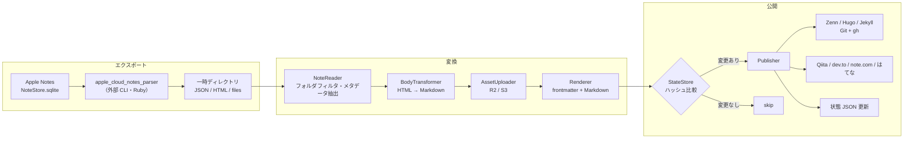

# design.md — note2web

requirements.md(以下「要件」)に基づく設計書。要件の FR / NFR 番号を参照する。

## 1. 設計方針

- **パイプライン構成**: 「エクスポート → 変換 → 公開」を単方向のパイプラインとして実装する(FR-31)。各段は「前段の出力」と、唯一の副作用ポートである **StateStore** のみに依存する。StateStore は実行開始時にディスクから状態を1回だけ読み込み、以後は自身の書き込みを反映した一貫ビューを全段に提供する(AssetUploader の既アップロード判定、Publisher への `prev: NoteState` 受け渡しはこのビューから行う)。書き込みは「アセットアップロード成功時」と「ノート配信の確定時」の2箇所に限定する(§5.6)
- **Publisher の抽象化**: 配信先ごとの差異は Publisher インターフェースの実装に閉じ込める。Git リポジトリ出力(Zenn / Hugo / Jekyll)は共通基盤 + サービス別の frontmatter・パス規約のみ差し替える
- **外部ツールはサブプロセス**: `apple_cloud_notes_parser`・`gh`・`@qiita/qiita-cli`・`noet` はすべて外部 CLI として呼び出す。ライブラリとしてリンクしない
- **失敗の局所化**: 1ノートの失敗が実行全体を止めない。失敗したノートは状態を更新せず、次回実行で自動的に再試行される(NFR-06)

## 2. 実装言語・ランタイム

**TypeScript(Node.js 20+)** を採用する。

- `apple_cloud_notes_parser` は gem ではなく「clone して bundler で動かすアプリケーション」であり、Ruby を選んでも in-process 利用はできず、サブプロセス呼び出しになる点は同じ
- Qiita(`@qiita/qiita-cli`)・dev.to 系ツールが npm パッケージであり、利用者の環境に Node.js がいずれにせよ必要になる
- HTML → Markdown 変換(unified / rehype-remark 系)、S3 互換クライアント(AWS SDK v3、R2 対応)、grapheme 分割(`Intl.Segmenter` 標準搭載)の各要素が揃っている
- 配布は npm(`npx note2web`)。Ruby(parser 用)は別途必要な依存としてドキュメントに明記する(NFR-05)

## 3. 全体アーキテクチャ



1回の実行は「1つの設定 YAML」に対して行う(FR-29)。複数サービスへ配信する場合は cron / launchd に設定ファイルの数だけエントリを登録する。

```
note2web sync --config ~/.config/note2web/zenn.yaml
```

## 4. 外部ツール調査結果(要件「未決事項」の解消)

設計にあたり一次情報を確認した。要件で未決としていた項目の結論:

| 未決事項 | 結論 |
|---|---|
| `apple_cloud_notes_parser` の出力形式 | HTML(表を実際の表として描画)・JSON(アカウント / フォルダ / ノートの要約、更新日時含む)・CSV・SQLite を出力。埋め込みファイル(画像・**描画**)は `files` フォルダに抽出される。UUID(`ZIDENTIFIER`)は HTML / CSV / JSON に出力可能で、`--individual-files` によるノート単位の HTML 出力と `--uuid` による UUID ベースの命名に対応。Markdown 出力は無い → **HTML を本文ソース、JSON をメタデータソースとする**(対応規約は §5.2)。**確認方法**: パーサ(commit `4754a2b`)を clone し、同梱の実エクスポート blob(`spec/data/exported_blobs/*.bin`)に対して実コード(`AppleNote#generate_html` 等)を実行し、`lib/` のソースと同梱 `JSON.md` を突き合わせて確認した。macOS 実機での `NoteStore.sqlite` に対するエンドツーエンド実行は未実施(§13 冒頭の注記、および `test/fixtures/parser-output/README.md` 参照) |
| 同・チェックリストの形式 | **確認済み(§13-1 解消)**。`<ul class="checklist" data-apple-notes-indent-amount="N">` の下に `<li class="checked">` / `<li class="unchecked">` が並ぶ(ネストは `li` の中に入れ子の `ul.checklist` を置く形)。実データ blob (`list_indents_gzipped.bin`) をパーサの実コードで実行して確認済み。詳細は §13 |
| 同・手書きの形式 | **確認済み(§13-2 解消)**。描画(`com.apple.drawing.2` / `com.apple.drawing` / `com.apple.paper`)は `files/Accounts/<アカウント UUID>/FallbackImages/<UUID>/...` にラスター画像(png/jpg/jpeg。実体は Apple 側が生成する「フォールバック画像」)として抽出され、ベクターデータそのものは出力されない。本文には `<a href="…"></a>` が挿入される。ソースコード読解により確認(exported_blobs に手書きの実データが無いため実行検証は未実施)。詳細は §13 |
| はてなブログ AtomPub の Markdown 入稿 | `content type="text/x-markdown"` で入稿可能(複数の実装事例で確認。公式仕様書はネットワーク制約で未参照のため実装時に実機確認)。**ブログの編集モードが Markdown であることを利用条件とする** |
| はてなブログの認証方式 | **Basic 認証(はてな ID + API キー)を採用**。HTTPS 経由のため十分であり、実装が最も単純 |
| dev.to の方式 | **Forem API v1 を直接叩く方式を採用**。`@sinedied/devto-cli` は「GitHub リポジトリに画像をホストする」ワークフロー前提で、本ツールの R2 / S3 方式と競合するため |
| Qiita の認証 | **確認済み(§13-3 解消)**。`qiita-cli` は `qiita login` による対話登録が基本だが、実装(`Credential.load`)は認証情報ファイルを読む**前に** `process.env.QIITA_TOKEN` の有無を確認し、設定されていればファイルを一切読まずにそれをアクセストークンとして使う。したがって note2web は**認証情報ファイルを生成する必要が無く**、`npx qiita publish` 実行時に子プロセスの環境変数 `QIITA_TOKEN` をセットするだけで無人実行できる(設計変更。詳細は §13-3)。note2web 側でトークンの取得元となる環境変数名は `qiita.token_env` で設定する(FR-30。既定のサンプルは `QIITA_TOKEN`)。QiitaPublisher は `token_env` が指す環境変数から値を読み、**子プロセスには常に `QIITA_TOKEN` という名前で**渡す(qiita-cli 側が参照する名前は `QIITA_TOKEN` 固定のため) |
| note.com | **確認済み(§13-4/§13-6 解消)。ただし重大な設計前提の崩れあり**。`noet`(kako-jun/noet, commit `e3a8562`)は要件調査時点(README.md の記載)とは**別物の内部アーキテクチャに移行済み**: 現行ソース(`apps/cli/src/cli.rs` 等)には note.com の非公式 API を直接叩くコードは無く、`Note.comのAPIは一切使用しない。すべての操作はブラウザ拡張機能を経由してDOM操作で行う`(`CLAUDE.md:19`)という設計に全面移行している。CLI はローカルの Chrome 拡張機能と `ws://127.0.0.1:9876` の WebSocket で通信し、拡張機能側が**実際にログイン中の人間のブラウザ**で note.com のページを開いて DOM 操作(フォーム入力・ボタンクリック)を行う(`apps/extension/src/background.js`)。README.md が案内する環境変数認証(`NOET_SESSION_COOKIE` 等)やレート制御(500ms 固定)は**現行コードには存在しない旧アーキテクチャの記述**(ソース grep で該当箇所ゼロ。詳細は §13-4)。この結果、**`noet` はサーバー / cron 上でヘッドレスに動かせる「gh・qiita-cli 相当のサブプロセス CLI」ではない**。加えて画像は note.com 側の ProseMirror エディタが Markdown 画像記法 `` を解釈しないため、外部 URL をそのまま本文に埋め込んでも画像としては表示されない(noet 自身の調査結果 `docs/IMAGE_UPLOAD_INVESTIGATION.md` より。§13-6)。**この2点は note2web の当初設計(サブプロセス呼び出し・R2/S3 URL そのまま埋め込み)の前提を崩す。T-25(issue #30)で対応方針を決定・実装済み: (1) 認証前提が満たされない実行(cron 等)ではノート単位の failed として扱う自動実行、(2) 画像を含むノートは note.com 向けでは明示的に failed とする(option (b))。詳細は §5.7 NotePublisher 節を参照** |
| Jekyll のファイル名規約 | `_posts/YYYY-MM-DD-<uuid>.md`。日付はノートの**作成日**を使う。初回配信時のファイル名を状態 JSON に記録し、以後は作成日が変わっても**記録済みファイル名を使い続ける**(URL の安定性を優先) |
| ハッシュアルゴリズム | SHA-256 |
| ログ形式・出力先 | JSON Lines を標準出力へ。設定でファイル出力を追加可能(§10) |
| 設定・状態の配置場所 | 設定: 任意パス(`--config` 必須)。推奨は `~/.config/note2web/`。状態: 既定で設定ファイルと同じディレクトリの `<設定名>.state.json`、`state_file` で変更可(§8) |
| 実装言語 | TypeScript / Node.js(§2) |
| UUID の安定性 | 保証しない前提で設計する。DB 復元等で UUID が変わった場合、旧記事はサービス側に残り(FR-18 の孤児許容と同じ扱い)、新 UUID で新規記事として配信される。制約としてドキュメントに明記 |

## 5. コンポーネント設計

### 5.1 CLI(`src/cli.ts`)

```
note2web sync --config <path> [--env-file <path>]     # メインコマンド。エクスポート→変換→公開を実行
note2web doctor --config <path> [--env-file <path>]   # 依存 CLI・環境変数・権限の事前チェックのみ実行
```

- `doctor` は NFR-05(依存欠如時の明確なエラー)を独立コマンドとしても提供するもの。`sync` も実行冒頭で同じチェックを行い、欠けていれば何も配信せずに失敗する
- **env ファイルの自動読み込み(issue #69)**: `sync` / `doctor` は設定検証(`loadConfig`)・依存チェック(`checkDependencies`)の前に、設定ファイルと同じディレクトリの `env` ファイル(既定パス。`--env-file` で上書き可能)を読み込み(`src/env-file.ts`)、`process.env` にまだ無い名前だけを補う(既存のシェル環境変数は常に優先)。issue #71 で launchd の plist が `node` を直接起動する構成(秘匿情報を含まない `PATH` のみを `EnvironmentVariables` に持つ)へ変わったため、この自動読み込みは単なる「対話シェルとの検証環境の一致」の補助ではなく、**launchd 経由の実行でトークン等の秘匿情報を `process.env` へ載せる唯一の経路**になっている。`init` はこの読み込みを行わない(生成物を書き出すのみのサブコマンドのため)
- 終了コード: 全ノート成功(スキップ含む)= 0、1件でも失敗 = 1、実行前提の不成立(設定不正・依存欠如)= 2

### 5.2 Exporter(`src/exporter/`)

note2web 独自の Ruby ドライバ(`ruby/note2web_export.rb` + `ruby/lib/note2web_export_core.rb`。issue #72)をサブプロセスで実行し、一時ディレクトリに出力させる。以前(issue #71 まで)は upstream の `apple_cloud_notes_parser` の `notes_cloud_ripper.rb` をそのまま実行していたが、これは Notes ストア全体を無条件にエクスポートするため、対象外フォルダ(「最近削除した項目」= ゴミ箱を含む)にあるどのノートか1件でもタイトルが極端に長い/壊れたものがあると、個別ファイル書き出し時のタイトル由来ファイル名組み立てで `Errno::ENAMETOOLONG` によりエクスポート全体が落ちる問題があった(issue #72、詳細・根拠は §13-8)。note2web 独自のドライバはこの問題を、対象フォルダ以外の生成・書き込みを一切行わない設計と、タイトルを一切ファイル名に使わない実装(UUID のみ)によって構造的に解消する。

- 実行例(既定): `bundle exec ruby <note2web のインストール先>/ruby/note2web_export.rb -m <Notesコンテナ> -o <tmpdir> --parser-lib <parser_path>/lib --folder <name> [--folder <name> ...]`(`cwd: parser_path`。`--folder` は `source.folders`(FR-02)の要素ごとに1つ)。launchd の最小限の `PATH`/`GEM_HOME` では素の `ruby` だけでは upstream の Gemfile の gem(`sqlite3`/`nokogiri` 等)が解決できず `LoadError` になりがちなため、`bundle exec` を既定の起動方法とする(issue #67)。`exporter.launcher: ruby` を指定すると `bundle exec` を挟まない `ruby <note2web_export.rb> ...` へフォールバックできる。`init` が生成する plist は rbenv/asdf/rvm の shim ディレクトリを検出できれば `PATH` へ自動的に含める(issue #71)が、`GEM_HOME` 等それ以外の変数は引き続き env ファイル側での手当てが必要
- upstream(`apple_cloud_notes_parser`)のインストール先パス(`exporter.parser_path`。中身の `lib/` だけを note2web 独自ドライバが `require` する)と Notes コンテナパスは設定 YAML の `exporter` 項目で指定(既定値あり、§8)。**upstream 自体のセットアップ手順(clone + `bundle install`)は変わっていない**。ライセンス・参照コミットは `NOTICE`(リポジトリルート)
- **早期フィルタの到達レベル(issue #72、§13-8 に詳細)**: upstream の `AppleNoteStore#rip_notes` はノート選択クエリが iOS/macOS バージョンごとに9通りの SQL 分岐を持ち、note2web 側で安全に上書き(monkey patch)する手段が無いため、フォルダ・ノート本体の読み取り自体は upstream にそのまま行わせる。ただし upstream 自身がノート読み取りを1件ずつ `rescue` 済みであり、実際の crash 原因はここではなく個別ファイル書き出し(下記)にあった。note2web 独自ドライバは**生成・書き込み**(`AppleNote#generate_html` の実行・JSON への採用・ファイル書き込み)を、`source.folders` のサブツリーに属し、ゴミ箱でなく、暗号化されていないノートに限定する。対象内ノートのデコード/生成失敗はノート単位で `begin/rescue` し、`skipped_errors`(下記 JSON)に記録して処理を継続する
- **HTML と UUID の対応規約(issue #72で単純化)**: 出力ディレクトリは `<出力先>/html/<uuid>.html` のフラット構成(以前あった `html/note_store<N>/<フォルダパス>/` という入れ子構成・フォルダパス再構築は廃止)。ファイル名は `Note2webExportCore.note_html_filename(uuid)` が `"#{uuid}.html"` として組み立て、タイトルは一切関与しない(`AppleNote#title_as_filename`/`AppleNoteStore#write_individual_html` は一切呼ばない。これが issue #72 の根本修正)。ファイル名が UUID そのものであるため、NoteReader(Exporter)は `html/<uuid>.html` を UUID から直接参照できる。対応する HTML が見つからないノートはそのノートのみ failed 扱いにする
  - 添付・描画の実体は `<出力先>/files/Accounts/<アカウント UUID>/...`(端末上のパスをそのまま踏襲。フォルダの見た目上のパスとは無関係。upstream がノートのデコード時点で書き出す)に置かれる。個別 HTML 内の相対パス(`../` の数)は upstream の `to_relative_root`(フォルダの深さ基準)をそのまま引き継いでおり、フラット化した実際の位置とは一致しないが、BodyTransformer(§5.4)は `href`/`src` の文字列ではなく `data-apple-notes-zidentifier`(UUID)属性で解決するため実害はない
  - JSON トップレベルの `folders`/`notes` は upstream の `note_store.prepare_json` を丸ごとは使わず、note2web 独自ドライバ(`Note2webExportCore` の組み立てヘルパー)が対象フォルダ・対象ノートのみを含む形で構築する(フィールド名は §13-7 のスキーマを踏襲)。加えて `skipped_encrypted`(パスワード保護ノート。復号せずスキップ)・`skipped_errors`(対象内ノート1件のデコード/生成失敗)の2配列を新設し、TS 側(`src/exporter/apple-notes.ts`)がそれぞれを `logger.warn` に変換する
- 出力のうち利用するもの:
  - **JSON**: フォルダ階層、ノート一覧、UUID、作成 / 更新日時 → `Note` モデルの骨格
  - **HTML**: ノート本文(表・書式を保持)→ 本文変換の入力
  - **files/**: 添付・描画の実体 → アセットアップロードの入力
- TS 側(`src/exporter/apple-notes.ts`)は、note2web 独自ドライバが既に `source.folders` で絞り込んだ JSON を渡してくる前提だが、同じサブツリーフィルタ(`buildFolderIndex`/`resolveIncludedFolderIds`)を defense-in-depth として引き続き適用する(コストが低く、ドライバ側の絞り込みが何らかの理由で漏れても対象外ノートが出力に混ざらない保証を TS 側単独でも持てるため)
- 毎回フルエクスポートする。差分判定はエクスポート段ではなく、変換後ハッシュで行う(FR-15)ため、エクスポートの増分化は不要

### 5.3 Note モデルとメタデータ抽出(`src/model/`, `src/transform/metadata.ts`)

```ts
interface Note {
  uuid: string;          // Apple Notes の UUID（FR-09）
  folder: string;        // フォルダ名（FR-06）
  title: string;         // 1行目から先頭絵文字を除去（FR-04）
  emoji: string | null;  // 1行目の1文字目（grapheme cluster、絵文字の場合のみ）（FR-05）
  tags: string[];        // ノート内ハッシュタグ（FR-07）
  createdAt: Date;       // FR-08
  updatedAt: Date;       // FR-08
  bodyHtml: string;      // parser が出力した当該ノートの個別 HTML（UUID で解決。§5.2）
  attachments: Attachment[];  // files/ 配下の実体への参照
}
```

- **JSON フィールドとの対応(§13-7 で確定)**: `uuid` ← JSON ノートオブジェクトの `uuid`、`folder` ← 同 `folder`(フォルダ名の文字列。フォルダ階層自体が必要な場合は JSON トップレベルの `folders`(`parent_folder_id` / `child_folders` で表現される入れ子構造)を別途辿る)、`createdAt` ← `creation_time`、`updatedAt` ← `modify_time`(いずれも `"YYYY-MM-DD HH:MM:SS +0000"` 形式の文字列。固定書式のため専用パーサ不要)、`bodyHtml` ← 個別 HTML ファイル(JSON の `html` フィールドではない。§5.2 参照)
  - **差分(調査により判明)**: 当初想定していなかったが、JSON のノートオブジェクトは `hashtags`(例 `["#タグ"]`)フィールドを**パーサ自身が抽出済み**の形で持つ(`lib/AppleNote.rb` `prepare_json`。埋め込みオブジェクト中の `AppleNotesEmbeddedInlineHashtag` を機械的に収集したもの)。したがって `tags` は本文 HTML の正規表現走査ではなく、この JSON の `hashtags` を第一の情報源とする方が頑健(絵文字や記号を含むタグの誤検出を避けられる)。ただし JSON の `hashtags` は「本文中のインラインタグ」と「タグ置き場として末尾に置かれた行のタグ」を区別しない一覧に過ぎず、**本文からタグのみの行を除去するかどうかの判定(下記)は引き続き HTML 側のテキスト解析が必要**であるため、`tags` の値の取得元だけを JSON に置き換え、本文除去ロジックは変更しない
- **1行目**: HTML 中の最初のブロック要素のテキストとする
- **絵文字判定**: `Intl.Segmenter` で先頭 grapheme を取得し、`\p{Extended_Pictographic}` にマッチする場合のみ絵文字として扱う。絵文字だった場合、タイトルは先頭 grapheme と直後の空白を除去した残り
- **ハッシュタグ**: `tags` の値は JSON ノートオブジェクトの `hashtags` フィールド(parser が抽出済み。上記差分参照)のみを情報源とし、本文からの正規表現抽出は行わない。**ハッシュタグのみで構成される行**(タグ置き場として末尾に置かれる行)を本文から除去するかどうかの判定にのみ、引き続き HTML 側のテキスト解析を用いる(文中に現れるタグは本文に残す)

### 5.4 BodyTransformer(`src/transform/`)

HTML → Markdown 変換。unified(rehype-parse → rehype-remark → remark-stringify + remark-gfm)を使用。

| 入力(HTML) | 出力(Markdown) | 要件 |
|---|---|---|
| `<table>` | GFM の表 | FR-11 |
| チェックリスト: `<ul class="checklist" data-apple-notes-indent-amount="N"><li class="checked">` / `<li class="unchecked">`(§13-1 で確認済み。ネストは `li` 内の入れ子 `ul.checklist`) | `- [x]` / `- [ ]`(インデントに応じてネスト) | FR-12 |
| 描画への参照: `<a href="…">/…" data-apple-notes-zidentifier="…"></a>`(§13-2 で確認済み。実体は `files/Accounts/<アカウント UUID>/FallbackImages/…` 配下のラスター画像) | 画像参照 `` | FR-13 |
| 添付への参照 | アセット URL(画像は ``、それ以外はリンク) | FR-14 |
| 見出し・リスト・強調等 | 対応する Markdown | FR-10 |
| 地の文の ```` ``` ```` フェンス(下記「コードフェンス認識」) | 逐語のコードブロック | (実機修正) |

- 1行目(タイトル行)は本文から除去する(タイトルは frontmatter へ)
- 変換で表現できない要素は、HTML のまま埋め込まず**テキスト化して警告ログ**を出す(サービス側での生 HTML の扱いが不定のため)
- **FR-14 の画像/リンク判定基準(実機 Qiita 公開で発覚した不具合の修正)**: `data-apple-notes-zidentifier` を `<a>` が直接持つ形(img を伴わない添付参照)を画像として `` にするかリンクのままにするかは、**HTML の形(img を伴うか)ではなく、参照先の添付(`Note#attachments` の `Attachment`)の種別**(`attachment.path` の拡張子が画像かどうか。`assets/uploader.ts` の Content-Type 推定テーブルと共有する `isImageExtension` で判定)で決める。識別子に対応する `Attachment` が見つからない(未知の参照)場合は、従来どおりリンクのままにする
- **コードフェンス認識(実機 Qiita 公開で発覚した不具合の修正)**: ノート本文に地の文として書かれた ```` ``` ````(コードフェンス)の行に囲まれた区間を、逐語(エスケープ無し)の Markdown コードブロックとして認識する。hast→mdast 変換後・`remark-stringify` 直列化前の mdast ツリーへの後処理として適用する
  - 対象は mdast ルートの**トップレベルの子のみ**(リスト・引用の内部は対象外)
  - 「フェンス行」は段落(`paragraph`)1つの内容全体(前後空白を trim したもの)が、開始行なら `` /^```([A-Za-z0-9_+#.-]*)$/ ``(言語トークン任意)、終端行なら完全一致の ` ``` ` に一致するものだけを指す。フェンス行が他の行と同じ段落を共有している場合は認識しない(通常のノートでは各行が独立した段落になるため問題にならない)
  - 開始フェンス行に対応する終端フェンス行が最後まで見つからない場合は**何も変更しない**(閉じ位置を推測しない)
  - コードブロックの内容は完全に逐語。内容が ` ``` ` を含む場合は `remark-stringify` が自動的に外側のフェンスを伸長する
  - フェンス区間内のアセット参照(添付・描画)はプレーンテキスト化され、参照自体は失われる(**コードフェンス内の添付参照は非対応**)

### 5.5 AssetUploader(`src/assets/`)

- AWS SDK v3(S3 互換)で R2 / S3 に対応。R2 は `endpoint` 指定で切り替え
- キー: `<prefix><content-hashの先頭2文字>/<content-hash>.<拡張子>`(FR-17)。content hash はファイル実体の SHA-256
- アップロード前に状態 JSON の `assets` を引き、既知の hash はスキップ(FR-17)
- 本文中の参照は `public_base_url` + キー に差し替える(FR-14)
- 手書き描画は parser が抽出した画像ファイルをそのまま同じ経路でアップロードする(FR-13)

### 5.6 Renderer と冪等判定(`src/transform/frontmatter.ts`, `src/state/`)

- サービス別の frontmatter(§9)+ 変換済み Markdown 本文を連結した**最終成果物の文字列**に対して SHA-256 を取る。これが「コンテンツハッシュ」(FR-15)
- frontmatter に実行時刻など毎回変わる値を**入れない**こと(冪等性が壊れるため)。日付はノートの作成 / 更新日時のみ使用する
- **直列化の正規化規約**(実行環境が変わっても同一入力から同一ハッシュになるように固定する):
  - 文字コードは UTF-8、改行は LF、テキストは Unicode NFC に正規化
  - frontmatter のキー順は §5.7 のサービス別表の記載順で固定。YAML は決定的な自前 serializer で生成し、ライブラリ既定の並べ替え・スタイル選択・引用判定に依存しない。**文字列値は内容にかかわらず常に JSON 互換のダブルクォート + エスケープ**(`\"` `\\` `\n` 等)で出力し、`null`・真偽値・数値・日時に見える文字列や `:` `#` を含む文字列も常に文字列として一意に復元できる形にする(非文字列型は真偽値・整数のみ許可し、YAML の暗黙の型解釈に委ねない)
  - 日時は秒精度の ISO 8601 で、設定 `timezone`(既定 `Asia/Tokyo`)の固定オフセットにより文字列化する。実行マシンの TZ・ロケールに依存しない
  - 同一入力 → 同一直列化結果 → 同一ハッシュを golden test で固定する(§12)
- StateStore は状態 JSON(§8)の読み書きを担う。**ディスクからの読み取りは実行開始時の1回**とし、以後の全段は「その内容 + 自身の書き込みを即時反映したメモリ上のビュー」を参照する(read-your-writes。同一実行内で複数ノートが同じアセットを参照しても、2件目以降は再アップロードしない)。書き込みは「一時ファイルに書いて rename」のアトミック更新とし、書き込みポイントは次の2つに限定する(途中クラッシュで成功済み分が失われないように、いずれも都度保存):
  1. **アセットアップロード成功時**: `assets` エントリのみ即時保存する。後段でそのノートの配信が失敗しても保存は維持され、次回実行で再アップロードしない(FR-17)
  2. **ノート配信の確定時**: API / CLI モードでは `publish()` 成功ごと、Git モードでは `finalize()` の PR 作成成功後に一括(§5.7)

### 5.7 Publisher(`src/publishers/`)

```ts
interface Publisher {
  // 変更のあったノートを配信し、サービス側の識別子等を返す
  publish(a: RenderedArticle, prev: NoteState | null): Promise<PublishResult>;
  // Git モードのみ: 全ノート処理後のコミット・PR 作成
  finalize?(): Promise<void>;
}
```

#### GitRepoPublisher(Zenn / Hugo / Jekyll 共通基盤)

1. 実行開始時に `repo_path` で `git fetch` → `base_branch` から作業ブランチ `note2web/sync-<UTC時刻>` を作成(FR-19)。時刻部分は `YYYYMMDDTHHMMSSZ` 形式とし、Git の ref 名に使えない `:` 等を含めない
2. `publish()` は変更のあったノートのファイルを規約パス(§9)へ書き込み、結果を**保留リスト**に積むだけ(この時点では状態 JSON を更新しない)
3. `finalize()`:
   - `git status` で差分ゼロなら、ブランチを削除して終了。コミットも PR も作らない(FR-22)
   - 差分があればコミット・`git push` し、`gh pr create` で PR 作成(FR-20)
   - `auto_merge: true` なら `gh pr merge --merge --delete-branch` を実行(FR-21)。ブランチ保護等でマージ不能なら PR を残したまま失敗として報告
4. **状態更新のトランザクション**: 保留リストのハッシュ確定・保存は **PR 作成成功後に一括**で行う。push や PR 作成に失敗した場合は何も確定せず、全ノートが次回実行で再試行される。確定基準をマージではなく PR 作成に置くのは、マージ待ちの間に再実行されても同内容のブランチが乱立しないようにするため。auto_merge なしで PR がクローズされた場合、その内容は再配信されない(次にノートが変更されるまで)。この挙動は README に明記する
5. **認証**: `gh` は `GH_TOKEN` 環境変数で認証する(NFR-03。対話ログインに依存しない)。`doctor` / `sync` 冒頭で `GH_TOKEN` の存在・`gh auth status`・対象リポジトリへの push / PR 作成権限を確認し、不備があれば配信前に exit 2
   - **`git` 呼び出しごとの credential-helper 強制(実機 Mac で観測された GCM ポップアップ対策)**: `git fetch` / `git push` を含む GitRepoPublisher の**全ての** `git` サブプロセス呼び出しは、サブコマンドの前に `-c credential.helper= -c credential.helper=!gh auth git-credential` を付与する(`src/publishers/git-repo.ts` の `GIT_CREDENTIAL_ARGS`)。理由: git は HTTPS リモートに対して `credential.helper` を **system → global → local の設定順に全て**呼び出す仕様であり、`gh auth setup-git` を実行済みでも system レベルに Git Credential Manager(GCM)や `osxkeychain` の helper が既に登録されていれば `gh` の helper より先にそれが呼ばれ、launchd 経由の非対話実行中に GUI 認証ポップアップが出て停止する。加えてユーザーが `gh` に複数の GitHub アカウントを認証している場合、`gh` 自身の「アクティブアカウント」解決に任せると認証に使われるアカウントが曖昧になる。前記2つの `-c` は(a) 空値の `credential.helper=` で system/global/local に設定済みの helper 連鎖を全てクリアし、(b) その上で `gh auth git-credential` **のみ**を有効にする。`gh auth git-credential` は環境変数 `GH_TOKEN` を `gh` の複数アカウント状態より優先して参照するため、note2web が渡す `GH_TOKEN` がそのまま認証アカウントを決定的に決める——**`gh auth setup-git` の実行は不要**になる。この `-c` はプロセス実行中のみ有効な一度限りの上書きで、リポジトリやユーザーのグローバルな git 設定は書き換えない。トークンの値自体は引数(argv)には一切現れず(FR-30)、`gh auth git-credential` が実行時に環境変数から読むだけ。`status`/`add`/`commit`/`checkout`/`branch -D` のようなローカル専用コマンドにもこの前置きを一律で付ける(認証を伴わないので無害。分岐を増やさず実装を単純に保つため)
   - 加えて全ての `git` 呼び出しの環境変数に `GIT_TERMINAL_PROMPT=0` と `GIT_ASKPASS=""`(空文字)を渡す。git は askpass を「`GIT_ASKPASS`(または `SSH_ASKPASS`/`core.askPass`)が設定されており、かつ空でない場合」にのみ起動するため、空文字で上書きすることで親プロセスから継承した GUI askpass プログラム経由の認証ダイアログ起動を封じる。`GIT_TERMINAL_PROMPT=0` は端末プロンプトへのフォールバックを封じる。この2つにより、上記の credential-helper 強制が何らかの理由で効かず認証情報が見つからない場合でも、git は GUI・端末いずれの対話にも入らず即座にエラー終了する(NFR「launchd で対話なし」の最終防波堤)

サービス別差分:

| | ファイルパス | frontmatter | 備考 |
|---|---|---|---|
| Zenn | `articles/<uuid小文字>.md` | `title` / `emoji` / `type` / `topics` / `published: true` | slug = UUID 小文字化(FR-23)。`type` はフォルダ名。`tech` / `idea` 以外のフォルダ名なら設定不正としてそのノートを失敗扱い(FR-24)。絵文字が無いノートは既定値 `📝`(Zenn は emoji 必須のため)。`topics` の制約(最大5個、半角スペース含みタグは警告除外)は下記「Zenn の連携前提と topics/slug 制約」参照 |
| Hugo | `<output_dir>/<uuid>.md` | `title` / `date`(作成日時)/ `lastmod`(更新日時)/ `categories: [フォルダ名]` / `tags` | `output_dir` は設定で指定(例 `content/posts`) |
| Jekyll | `_posts/YYYY-MM-DD-<uuid>.md` | `title` / `date` / `categories` / `tags` | 日付は作成日。初回のファイル名を状態に記録し固定(§4) |

#### Zenn の連携前提と topics/slug 制約(issue #76)

- **GitHub リポジトリ連携のみ・zenn-cli は使わない**: Zenn との連携は `articles/` にファイルを置いて対象リポジトリへ push するだけで完結し(Zenn 側が push を検知して取り込む)、`zenn-cli`(`zenn init`/`zenn preview` 等)のインストール・実行は前提にしない。`src/dependencies.ts`・`src/doctor.ts`・`package.json`・README のいずれにも `zenn-cli` への依存記述は無い(GitRepoPublisher(`src/publishers/git-repo.ts`)が担う `git`/`gh` サブプロセスのみが前提)
- **`topics` の制約**: Zenn 公式ガイド(https://zenn.dev/zenn/articles/zenn-cli-guide)は `topics` の**個数上限が最大5個**であることを明記する(issue #76 の調査コメントに基づく。当環境から `zenn.dev` へ直接到達できないため、公式ガイドの原文はこのプロジェクトの CodeRabbit issue plan の調査結果を典拠とする)。一方、**タグの文字種についての公式仕様は明記が無い**(同issue plan の Design Choice 1)ため、本実装は文字種を強制検証しない——利用者のタグを予期せず失わせないための判断であり、Qiita と同様に**確実に受け付けないと分かっている半角スペース含みタグのみ**警告つきで除外する。`resolveZennTopics`(`src/publishers/zenn.ts`)は Qiita の `resolveQiitaTags` と同じ処理順(先頭 `#` 除去 → 除去後に空になったタグを警告除外 → 半角スペース含みタグを警告除外 → 6個以上なら先頭5個に切り詰めて警告)で `topics` をサニタイズする。**Qiita と異なりサニタイズ後0個でも失敗にしない**——Zenn は `topics` の省略・空配列を許容するため、空配列 `[]` をそのまま出力する
- **slug(ファイル名)の制約**: Zenn 公式ガイドの slug 制約は次のとおり(issue #76 のコメントに引用された原文。当環境から `zenn.dev` へ直接到達できないため、この issue コメントの引用を確認済みの一次情報として採用する):

  > 2. slugは半角英小文字(`a-z`)、半角数字(`0-9`)、ハイフン(`-`)、アンダースコア(`_`)の12〜50字の組み合わせにする必要があります。

  現行実装の `ZENN_SLUG_PATTERN = /^[a-z0-9_-]{12,50}$/`(`src/publishers/zenn.ts`)はこの制約と一致する。slug = ノート UUID の小文字化(ハイフン込み36文字)であり、パターンを満たさない場合は防御的に `InvalidZennSlugError` で当該ノートのみ失敗扱いにする(通常の Apple Notes UUID では発生しない)。slug はサイト全体でユニークである必要があるという制約も、UUID 由来のため他ユーザーとの衝突は実質的に起こらず、一度確定した slug はノートの UUID に紐づき不変(状態 JSON が `artifactPath` を記録し、再配信は常に同一 slug への更新)であるため、slug 不変性の制約とも整合する

#### QiitaPublisher

- 設定で指定した qiita-cli ワークスペース(`itemsRootDir`。qiita-cli 実行時に `--root <workspace>` で指定するか、`QIITA_CLI_ITEMS_ROOT` 環境変数で指定。§13-3)の `public/<uuid>.md`(`<itemsRootDir>/public/<basename>.md`。`dist/lib/file-system-repo.js` `getRootPath` / `getFilePath`)に書き、`npx --no-install qiita publish <uuid> --root <workspace>` を実行(FR-25)
- **CLI のパッケージ解決(セキュリティ制約)**: `@qiita/qiita-cli` は T-21 で note2web の `dependencies` に**固定バージョンで追加**し(lockfile にも固定)、実行は **`npx --no-install qiita`**(またはローカルの `node_modules/.bin/qiita`)に限定する。素の `npx qiita` はローカル未導入時に npm レジストリの **`qiita` という別パッケージ**(公式 CLI ではない)を取得しに行き、そのプロセスにトークン入りの環境変数が渡ってしまうため**禁止**。未導入の場合は `checkDependencies`(doctor / sync の前提チェック)で exit 2 とし、あわせて qiita-cli の要求する Node.js engine(>= 20)を満たすことも事前検証する
- frontmatter: `title` / `tags` / `private: false` / **`updated_at: ""`** / `id`(初回は `null`、qiita-cli が投稿後に書き戻す ID を読み取って状態 JSON に保存)/ **`organization_url_name: null`** / **`slide: false`**(いずれも qiita-cli の型チェックで判明した差分。下記参照)
  - **差分(調査により判明)**: qiita-cli の frontmatter 型チェック(`dist/lib/check-frontmatter-type.js` `checkSlide`)は `slide` が **真偽値であること**を要求しており(`typeof slide === "boolean"`)、フィールド自体が無い(`undefined`)場合は型エラーとして `publish` が失敗する。当初の想定(`title` / `tags` / `private` / `id` の4項目)には無かったフィールドのため、QiitaPublisher が書き出す frontmatter には `slide: false` を必須項目として追加する
  - **差分(実機の `publish` 失敗で判明)**: 同チェックの `checkUpdatedAt` / `checkOrganizationUrlName` は `updated_at` / `organization_url_name` が **null または文字列であること**を要求しており、キー欠落(`undefined`)では `publish` が失敗する。qiita-cli 自身の新規テンプレート既定値(`updated_at: ''` / `organization_url_name: null`)を常に書き出す。`updated_at` の空文字は Invalid Date になり publish の「ローカルがリモートより古い場合の拒否」ガード(`isOlderThanRemote`)の日時比較が常に false となるため、新規・更新のどちらも拒否されない
- タグ制約(1〜5個必須、スペース不可)への対処:
  - 半角スペースを含むタグは**除外**し警告ログ(分割送信による 403 を防ぐ)
  - 除外後 6個以上なら先頭5個に切り詰めて警告ログ
  - 除外後 0個ならそのノートは**失敗扱い**(エラーログ。タグを付けて再実行してもらう)
- 認証: 設定 `qiita.token_env` が指す環境変数からトークンを読む(FR-30。サンプル設定では `QIITA_TOKEN`)。**確認済み(§13-3)**: `qiita-cli` は `qiita login` の認証情報ファイルより先に `QIITA_TOKEN` 環境変数を見るため、QiitaPublisher は `token_env` の値を子プロセス環境変数 **`QIITA_TOKEN`(qiita-cli 側の参照名は固定)** にセットして `npx qiita publish` を呼ぶだけでよく、認証情報ファイルの生成・`qiita login` の代替実装は不要

#### DevtoPublisher

- Forem API v1 を直接呼ぶ(FR-26)。新規 `POST /api/articles`、更新 `PUT /api/articles/{id}`(`{id}` は状態 JSON の `remoteId`)
- **wire contract**:
  - ヘッダ: `api-key: <トークン>`、`Content-Type: application/json`、`Accept: application/vnd.forem.api-v1+json`
  - リクエストボディ(新規・更新共通): `{"article": {"title": …, "body_markdown": …, "published": true, "tags": "<カンマ区切り・最大4個>", "canonical_url": …}}`。`canonical_url` は設定 `canonical_base_url` がある場合のみ含める
  - 成功レスポンスの `id` を状態 JSON の `remoteId` に、`url` を `url` に保存する
- `tags` は先頭4個に切り詰め(超過時は警告ログ)
- 認証トークンは環境変数(既定 `DEVTO_API_KEY`)

#### NotePublisher

**調査済み(§13-4/§13-6)。T-25(issue #30)で実装済み。以下は実装を確定した契約(旧「推奨対応」の決定結果)。**

- **コマンド体系(§13-4)**: `noet` に「公開」を意味する単一コマンドは無い。新規は `noet create <file>`、更新は `noet update <key> <file>` を使う(`--draft` を付けない = 公開。NotePublisher は常に公開する。下書き運用は本タスクの範囲外)。記事ファイルは `noet` ワークスペース内の決まったディレクトリ(Hugo の `content/` に相当するもの)に置く規約は無く、任意パスの Markdown ファイルを引数で渡す。NotePublisher は `config.note.workspace` 配下に `<uuid>.md`(状態 JSON の `artifactPath` はこの相対パス)を書き出し、`<file>` にはその絶対パスを渡す。`cwd` はワークスペースルートに固定する(`src/publishers/note.ts`)
- **認証・実行モード(§13-4。決定: 自動実行 + ドキュメント化された構造的制約)**: `noet` は note.com への認証を**自分では一切管理しない**。認証状態は「その時ブラウザ拡張機能が開いている実ブラウザが note.com にログイン済みか」で決まり、環境変数・トークン・cookie を渡す手段は現行コードに存在しない(現行の設定スキーマ `note: { workspace }` に `*_env` は無い)。T-25 はこの制約を受け入れたうえで issue #30 の受け入れ条件どおり `noet create`/`update` を実際に呼び出す自動実行を実装した: **前提条件は「同一マシン上で note.com にログイン済みの実 Chrome ブラウザ + noet 拡張機能が稼働していること」であり、これを満たさない実行(cron / launchd 等の無人実行を含む)では `noet` 呼び出し自体が失敗する**。これは NotePublisher のバグではなく、失敗したノートは `'failed'` として隔離され次回実行で再試行される(NFR-06、§1「失敗の局所化」)——**note.com 向けに `sync` を完全無人で回すことは構造的に不可能**という結論そのものは変わらず、単に「その場合にどう失敗するか」を(半自動モードへ後退するのではなく)ノート単位の failed として扱うことで解決した
- **記事 ID の受け渡し(§13-4)**: `noet create` の成功時、公開直後のリダイレクト先 URL(`https://note.com/<user>/n/<key>` 形式)が標準出力に含まれる前提で正規表現抽出する(実際の `noet` CLI の標準出力書式は本タスクの環境では確認不能。§12 参照)。抽出できない場合は `remoteId: null` のまま成功を記録すると次回実行が重複作成しかねないため、あえて例外を投げてそのノートを failed 扱いにする(状態は確定保存しない)。`remoteId`(状態 JSON)が既知の更新では `noet list` による事前照合は行わない
  - **照合の安全条件・完全性の確認方法(決定)**: `noet list` は `/notes` ページの DOM スクレイプであり、ページング処理を持たないため一覧が完全である保証が一般には無い(§13-4)。T-25 は**唯一構造的に正当化できる特殊ケース**——`noet list` の出力が完全に空(記事0件)——のみを「完全性が確認できた」とみなす: 0件の一覧には隠れうる後続ページがそもそも存在しないため、DOM スクレイプの限界とは無関係に論理的に真である。この完全性は実行(run)単位でキャッシュし、以後その run 内で NotePublisher 自身が `create` した記事をキャッシュへ追記していく限り保たれる(dev.to/はてなの per-run キャッシュ + `publishChain` 直列化と同じパターン)。一覧が空でない場合は、対象タイトルの一致がちょうど1件(ID 採用・更新)または2件以上(`NoteAmbiguousTitleMatchError`、failed)の場合を除き、「0件 = 未作成」と断定できないため actionable なメッセージ(手動で `noet` を実行するか、状態 JSON へ直接 `remoteId` を設定することを促す)とともに failed とし状態を更新しない。`noet list` の1行の解析書式(タブ区切り `title\tkey\tstatus`)は実際の `noet` CLI 出力から確認できていない暫定実装であり、実機確認(§12)で書式が異なると判明した場合は `src/publishers/note.ts` の `parseNoteList` のみを差し替えればよい設計にしてある
- **レート制御(§13-4。設計前提の訂正)**: README.md や CHANGELOG.md が述べる「500ms 固定のレート制限」は API 直叩き時代の実装(`NoteClient`)の記述であり、現行ソースに rate limiter は存在しない(`rate_limit` / `RateLimit` で grep してヒットなし)。代わりに `background.js` の DOM 操作全体に、ボット検知回避を目的とした乱数遅延(`randomDelay(300, 5000)` 相当。`humanPageLoadWait`/`humanActionPause` 等)が散在しており、**1回の `create`/`update` はブラウザのページ遷移込みで実測十数〜数十秒かかる設計**。§6 のサブプロセス共通タイムアウト(その他ツール5分。`DEFAULT_TIMEOUTS.default`、NotePublisher もこれを使う)は1回あたりには足りるが、拡張機能側の1コマンドあたりタイムアウトは60秒(`extension_client.rs:19` `COMMAND_TIMEOUT`)であり、画像を含む記事では複数回の待機(`waitForCondition` 系、最大15秒×画像数)が積み重なり60秒に接近し得る点に注意
- **画像(§13-6。決定: option (b))**: R2 / S3 の外部公開 URL を Markdown の `` のまま本文に残しても、note.com の編集画面(ProseMirror)は画像記法を解釈せず**リテラルなテキストとして表示される**(noet 自身の実機調査 `docs/IMAGE_UPLOAD_INVESTIGATION.md` / `docs/MARKDOWN_SUPPORT_TEST.md`。§13-6)。noet 側は「先に noet 自身が画像を note.com にアップロードしてから、本文中の参照をその URL に置換する」実装(`create --images` 経路)を用意しているが、「統合テスト未実施」(`docs/IMAGE_FEATURE_STATUS.md:109-141`)の未検証機能であるため、T-25 は**より安全な (b) を採用した: 画像参照(インライン ``・参照形式・ショートカット参照のいずれも)を含むノートは note.com 向けでは明示的に failed とし、エラーメッセージ(`NoteImagesUnsupportedError`)で非対応を伝える**。issue #30 本文が述べる「R2/S3 の URL のまま送る」は T-24 スパイク前の古い前提であり、本節(§13-6 の調査結果)で上書き済み。(a)(noet の `--images` 経路をローカルファイル参照で使う)は将来 noet 側の統合テストが揃った時点での再検討課題として残す
- **結論**: 上記により、note.com は他サービス(Git 系・Qiita・dev.to・はてな)と異なり**ヘッドレス / 無人実行が構造的に不可能**(実ブラウザに人間がログインしている必要がある)ままだが、T-25 はこれを「配信対象から外す」のではなく「満たされない場合はノート単位の failed として扱う」ことで自動実行を実現した(上記「認証・実行モード」参照)。**「他 Publisher と同様の完全無人 `sync`」は note.com には適用できない**ことは変わらずドキュメント(README 等)に明記する。

#### HatenaPublisher

- AtomPub(FR-28)。新規 `POST <blog>/atom/entry`、更新 `PUT <blog>/atom/entry/<entry_id>`(entry_id は状態 JSON から)
- `content type="text/x-markdown"` で Markdown 本文をそのまま入稿。`<category term="フォルダ名"/>`、タグもはてなではカテゴリとして表現されるため `category` 要素で送る
- 認証: Basic(はてな ID + API キー)。API キーは環境変数(既定 `HATENA_API_KEY`)

#### 応答不明時の重複防止(API / CLI 系 Publisher 共通)

新規作成の要求が受理されたのに応答が失われた場合(タイムアウト・接続断)、記事は作成済みだが `remoteId` が未保存になり、素朴に再試行すると重複記事を作る。次の規約で防ぐ:

- HTTP はタイムアウト 30 秒。**新規作成(POST)は自動リトライしない**。更新(PUT)は同一内容の再送が冪等なので、接続系エラーに限り1回だけ再試行してよい
- `remoteId` の無いノートを新規作成する**前に、既存記事の照合**を行う:
  - dev.to: 自分の記事一覧 API からタイトル一致で検索
  - はてな: コレクション URI の entry 一覧からタイトル一致で検索
  - Qiita: qiita-cli が投稿後に frontmatter へ書き戻す `id` をワークスペースのファイルから読む(CLI 側の機構をそのまま利用し、独自照合はしない)
  - note.com: **確認済み(§13-4)**。`noet list` が `/notes` ページを DOM スクレイピングして返す記事一覧(タイトル・key・status)からタイトル一致で照合する。この一覧取得はページネーションに対応していないため、対象記事が一覧の初期表示範囲に無い場合は0件判定になり得る点に注意(§13-4)
- 照合結果の扱い: **ちょうど1件一致**した場合のみその ID を `remoteId` に採用し、更新として配信する。**0件**なら記事は未作成と判断して新規作成する。**複数一致**の場合は誤った記事への紐付けや重複作成を避けるため、そのノートを failed とし状態を更新しない(警告ログを出し、手動での解決を促す)
  - **note.com 固有の例外**: `noet list` は一覧の完全性を保証しないため、「0件なら新規作成」は**一覧が完全と確認できた場合(= 一覧が空だった場合)のみ**適用する(`src/publishers/note.ts` の `listAbsenceTrusted`)。一覧が空でないのにタイトル一致が0件の場合は確認不能として failed とし、状態を更新しない(§5.7 NotePublisher の「照合の安全条件」)

## 6. 処理フロー

```text
sync:
  0. env ファイルの読み込み(既定: 設定ファイルと同じディレクトリの `env`。`--env-file` で上書き可。
     `process.env` に未設定の名前のみ補う。issue #69。§5.1 参照)
  1. 設定 YAML 読み込み・検証(環境変数の存在チェック含む)
  2. 依存チェック（下表。service ごとに必要なものだけ）        … 失敗なら exit 2
  3. Exporter 実行 → 一時ディレクトリ
  4. JSON からノート一覧を構築、設定の folders でフィルタ(FR-02)
  5. Git モードなら作業ブランチ作成
  6. 各ノートについて（1件ずつ、失敗は隔離）:
     a. メタデータ抽出 → 本文変換
     b. アセット: 状態 JSON に無い hash のみアップロードし、
        成功ごとに assets エントリを即時保存（§5.6。後段が失敗しても維持）
     c. frontmatter + 本文をレンダリング → SHA-256
     d. 状態 JSON の content_hash と一致 → skip をログして次へ
     e. 不一致 → Publisher.publish()
     f. 成功 → published/updated をログ。ノート状態の確定は
        API / CLI モード: この時点で保存、Git モード: 保留（finalize() で一括。§5.7）
        失敗 → ノート状態は触らず failed をログ（次回再試行）
  7. Git モード: finalize()（差分ゼロならブランチ破棄。PR 作成成功後に保留分を一括保存）
  8. 一時ディレクトリ削除、サマリログ、終了コード決定
```

依存チェック(手順2)の対象は service と公開モードで決まる。不要な依存は要求しない:

| service | 必須依存(共通分を除く) |
|---|---|
| 共通 | `ruby`(>= 3.0)+ `apple_cloud_notes_parser`、R2 / S3 の認証環境変数。`exporter.launcher`(既定 `bundle`)が `bundle` のときは加えて `bundle` コマンドと `bundle check` による gem 準備状況(issue #67)。加えて `exporter.notes_container` が指す Notes コンテナディレクトリと `NoteStore.sqlite` の存在・読み取り可否(issue #69。未許可が最も多い原因はフルディスクアクセス未付与で、フルディスクアクセスが無いと `apple_cloud_notes_parser` は `no such table: ZACCOUNT: (SQLite3::SQLException)` という原因の分かりにくいエラーで失敗する) |
| zenn / hugo / jekyll | `git`、`gh` + `GH_TOKEN`(Git モードのみ `gh` を要求) |
| qiita | Node.js(qiita-cli の要求 engine >= 20)、`@qiita/qiita-cli`(note2web の `dependencies` に固定バージョンで追加し、`npx --no-install` で解決。§5.7。**現時点では未導入・依存チェック未実装 = T-21 で実装する契約**)、`qiita.token_env` が指す環境変数(サンプルでは `QIITA_TOKEN`) |
| devto | `DEVTO_API_KEY` のみ(API 直接。CLI 不要) |
| note | `noet` バイナリ(`checkDependencies`、T-25 で `src/dependencies.ts` に実装済み)に加え、**同一マシン上で note.com にログイン済みの実 Chrome ブラウザ + noet 拡張機能が起動していること**(§13-4)。トークン等の環境変数では代替できず、`doctor`/`sync` 冒頭の自動チェックで確認できる項目ではない(拡張機能との WebSocket 接続失敗は `noet` サブプロセス実行時に初めて判明し、当該ノートのみ failed になる。§5.7 NotePublisher「認証・実行モード」参照)|
| hatena | `HATENA_API_KEY` のみ(API 直接。CLI 不要) |

- **多重起動防止**: 状態 JSON と同じ場所にロックファイルを置く。`O_CREAT | O_EXCL` によるアトミック作成とし、自プロセスの PID と **OS から取得したそのプロセスの開始時刻**を記録する。既にロックが存在する場合:
  - 記録された PID が生存しており、かつその PID の現在のプロセス開始時刻が記録と一致する(同一プロセスと確認できる)なら exit 2
  - PID が存在しない、または開始時刻が不一致(PID 再利用)の場合のみ stale と判定する。生存・開始時刻のどちらかが確認できない場合は削除せず exit 2
  - stale 回収は「ロックファイルを一時名へ rename して隔離 → 隔離したファイルの内容が判定時に読んだ内容と一致することを確認 → `O_CREAT | O_EXCL` で新規取得」の手順とする。内容が一致しない場合は判定と rename の間に別プロセスが新しいロックを作っているため、隔離を取り消して exit 2(TOCTOU 防止)
  - これにより、異常終了でロックが残っても以後の実行は恒久的に止まらず、生存中のプロセスのロックを誤って奪うこともない
- **サブプロセス実行の共通規約**(`apple_cloud_notes_parser` / `gh` / `qiita-cli` / `noet` / `git`): 各コマンドにタイムアウトを設ける(parser: 15分、その他: 5分)。超過時はプロセスグループごと SIGTERM を送り、10秒待って残存すれば SIGKILL。失敗は `timeout` / `exit_code` / `signal` に分類し、failed ログの `error` に記録する。正常・異常いずれの終了経路でも一時ディレクトリの削除とロック解放を必ず実施する(プロセス自体のクラッシュで実施できなかった場合は、次回実行の stale ロック回収で回復する)

## 7. 設定 YAML スキーマ

```yaml
# 共通部
service: zenn                  # zenn | hugo | jekyll | qiita | devto | note | hatena
timezone: Asia/Tokyo           # frontmatter 日時の固定オフセット（ハッシュ安定化のため。既定 Asia/Tokyo）
source:
  folders: [tech, idea]        # 配信対象フォルダ（FR-02）。Zenn ではフォルダ名が type になる
exporter:
  parser_path: ~/tools/apple_cloud_notes_parser   # clone 先
  notes_container: ~/Library/Group Containers/group.com.apple.notes  # 既定値
  launcher: bundle             # bundle | ruby（既定 bundle。bundle exec ruby で起動。issue #67）
state_file: ./zenn.state.json  # 省略時: <設定ファイル名>.state.json
log:
  file: ~/Library/Logs/note2web/zenn.log   # 省略可。標準出力へは常に出す
assets:
  provider: r2                 # r2 | s3
  bucket: blog-assets
  endpoint: https://<account>.r2.cloudflarestorage.com   # r2 のとき必須
  region: auto
  prefix: notes/
  public_base_url: https://assets.example.com/notes/
  access_key_id_env: R2_ACCESS_KEY_ID       # 環境変数名を書く。値は書かない（FR-30）
  secret_access_key_env: R2_SECRET_ACCESS_KEY

# --- Git 出力モード（zenn / hugo / jekyll）のみ ---
git:
  repo_path: ~/src/zenn-content
  base_branch: main
  output_dir: articles         # hugo/jekyll で使用。zenn は articles 固定
  auto_merge: true             # FR-21

# --- サービス固有（該当 service のときのみ）---
qiita:
  workspace: ~/src/qiita-content
  token_env: QIITA_TOKEN
devto:
  api_key_env: DEVTO_API_KEY
  canonical_base_url: https://example.com/articles/   # 省略可
note:
  workspace: ~/src/note-content
hatena:
  hatena_id: example
  blog_id: example.hatenablog.com
  api_key_env: HATENA_API_KEY
```

- 秘匿情報のキーはすべて `*_env`(環境変数名)であり、値の直書きはスキーマ検証で拒否する(FR-30)
- 検証には JSON Schema(zod 等)を使い、不正時はどのキーが問題かを明示して exit 2

## 8. 状態 JSON スキーマ

設定ファイルごとに1つ(FR-16)。

```json
{
  "version": 1,
  "service": "zenn",
  "target": "配信先の識別子。Git モード: repo_path、qiita / note: workspace、hatena: blog_id、devto: API ホスト",
  "notes": {
    "5c1c2c3d-…-uuid": {
      "contentHash": "sha256:ab12…",
      "remoteId": "qiita の記事ID / dev.to の id / はてなの entry_id。Git モードでは null",
      "url": "サービス側 URL（取得できる場合）",
      "artifactPath": "articles/5c1c2c3d-….md（Git モード。Jekyll のファイル名固定にも使用）",
      "firstPublishedAt": "2026-08-11T00:00:00+09:00",
      "lastPublishedAt": "2026-08-11T00:00:00+09:00"
    }
  },
  "assets": {
    "ab12cd…(content hash)": {
      "key": "notes/ab/ab12cd….png",
      "url": "https://assets.example.com/notes/ab/ab12cd….png",
      "uploadedAt": "2026-08-11T00:00:00+09:00"
    }
  }
}
```

- 読み込み時に `version`・`service`・`target` を検証する。未知の `version`、または `service` / `target` が現在の設定と一致しない場合は exit 2(状態ファイルの流用によって、別の配信先の `contentHash` で skip したり別サービスの `remoteId` で更新したりする事故を防ぐ)。`target` は新規作成時に設定から記録する
- ノートの削除・移動時もエントリは削除しない(FR-18。単に参照されなくなるだけ)

## 9. ログ設計(NFR-01)

JSON Lines。1行1イベント。標準出力へ常時、設定があればファイルにも追記。

```json
{"ts":"2026-08-11T09:00:00+09:00","level":"info","event":"note_published","service":"zenn","noteUuid":"5c1c…","title":"…","result":"updated","url":"…"}
```

| event | 意味 |
|---|---|
| `run_start` / `run_end` | 実行の開始 / 終了(run_end に成功・スキップ・失敗の件数サマリ) |
| `export_done` | エクスポート完了(ノート件数) |
| `note_published` | 配信成功(`result`: `created` / `updated`) |
| `note_skipped` | ハッシュ一致で配信不要 |
| `note_failed` | 配信失敗(`error` にメッセージ) |
| `asset_uploaded` | アセットアップロード |
| `warn` 系 | タグ切り詰め、表現できない要素のテキスト化等 |

「何を(noteUuid / title)・いつ(ts)・どのサービスに(service)・成否(event / result)」がこの1行で追える。

## 10. エラーハンドリング

| 障害 | 挙動 |
|---|---|
| 設定不正・環境変数未設定・依存 CLI 欠如 | 何も配信せず exit 2(NFR-03/05) |
| parser の実行失敗 | 実行全体を中断、exit 1(以降の判定材料が無いため) |
| 個別ノートの変換・配信失敗 | そのノートのみ failed、状態未更新、処理続行(NFR-06) |
| アセットアップロード失敗 | そのノートを failed 扱い(URL 未確定の本文を配信しない) |
| `gh pr merge` 失敗(保護ルール等) | PR は残し、実行は失敗として報告 |
| 多重起動 | 生存プロセスのロック検出で即 exit 2(stale ロックは自動回収して続行。§6) |

## 11. リポジトリ構成(本体)

```
note2web/
  src/
    cli.ts  config.ts  logger.ts  lock.ts
    exporter/apple-notes.ts
    model/note.ts
    transform/{metadata,html-to-markdown,frontmatter}.ts
    assets/uploader.ts
    state/store.ts
    publishers/{base,git-repo,zenn,hugo,jekyll,qiita,devto,note,hatena}.ts
  test/
    fixtures/
      parser-output/  # apple_cloud_notes_parser の実出力を模したサンプル(--individual-files --uuid)
        json/all_notes_1.json
        html/note_store1/…            # フォルダ階層を反映した個別 HTML(§5.2 のパス規約どおり)
        files/Accounts/<uuid>/…       # 添付・描画の実体
        README.md                     # 由来・確認方法・匿名化方針(§13 参照)
  requirements.md  design.md  README.md
```

## 12. テスト方針

- **ユニット**: メタデータ抽出(grapheme / 絵文字判定・ハッシュタグ行の除去)、HTML→Markdown(表・チェックリスト)、frontmatter 生成、タグ制約の切り詰めロジック
- **golden test**: 正規化直列化の固定(§5.6)。同一入力ノートに対して期待する直列化文字列とハッシュ値をリポジトリに固定し、serializer・依存更新でハッシュが変わったら検知する。ケースには YAML の境界値(`null` / 真偽値 / 数値 / 日時に見える文字列、`:` `#` `"` `\` 改行を含む文字列)を必ず含める
- **結合**: `test/fixtures/parser-output/`(**表・チェックリスト・描画参照・絵文字タイトル+ハッシュタグ+ネストフォルダを含む複数ノート**の fixture)でエクスポート以降を通しで検証。JSON の UUID と個別 HTML(`--individual-files --uuid`)の対応が一意に解決できることをここで検証する。Publisher は外部呼び出し(git / gh / HTTP / CLI)をモック化
  - この fixture は実機の `NoteStore.sqlite` からではなく、parser 実装をパーサ同梱の実エクスポート blob に対して実行した結果 + ソースコード読解によって構成した(T-08, §13)。由来・確認方法・各ノートがどこまで実行検証済みかは `test/fixtures/parser-output/README.md` に明記する
- **実機確認**(CI 不能なもの): noet の公開フロー、はてな AtomPub での `text/x-markdown` 入稿(T-23 時点の状況は §13-5 参照。wire contract 自体の実装と HTTP モックでの検証は完了しており、残るのは実際のはてなブログへの入稿確認のみ)、**qiita-cli の実トークンでの認証・記事公開**。§13 の項目と対応
  - noet(note.com)は他の実機確認項目と性質が異なる: 確認すべきなのは「wire contract の細部」ではなく「note.com にログイン済みの実ブラウザ + noet 拡張機能を用意した状態で `noet create`/`noet update` が実際に記事を作成・更新できるか」「作成直後に `noet list` で該当記事の `key` を一意に特定できるか」「画像を noet 自身の画像アップロード機能経由で送った場合に本文中の参照が正しく置換されるか(`docs/IMAGE_FEATURE_STATUS.md` が『統合テスト未実施』とする部分)」の3点であり、いずれも GUI ブラウザとログイン済みアカウントを要するため本タスクの環境(egress 遮断・GUI 無し)では原理的に検証不能。§13-4/§13-6 参照
  - qiita-cli は確認範囲を分けて扱う: **無人実行経路**(認証情報ファイル不要・`QIITA_TOKEN` 環境変数のみで対話なしに HTTP 要求まで進むこと)は §13-3 のとおりパッケージ実装の読解 + ローカル実行で確認済み。一方、**実トークンでの認証成功・記事公開成功**は未確認であり、実機確認の対象として残る。また、この確認は `node dist/main.js` の直接実行によるもので、実運用コマンド `npx qiita publish` のパッケージ解決(`qiita` → `@qiita/qiita-cli`)は未確認。QiitaPublisher 本体と `@qiita/qiita-cli` の導入は T-21 時点でも未実装・未導入である(§13-3 は調査のための一時インストールで確認した)

## 13. 実装時に確認が必要な残課題

**確認方法についての注記(1・2・7 に共通)**: 本タスクの実行環境には macOS も実機の Apple Notes データベースも無いため、「実機確認」は `apple_cloud_notes_parser`(commit `4754a2b62686570cca46690d101079e80cf6ae66`, 2026-07-25)の**実装をパーサ同梱の実エクスポート blob(`spec/data/exported_blobs/*.bin`)に対して実行**し、加えて `lib/` のソースコードと同梱 `JSON.md` を読解する、という方法で代替した。macOS 実機で `NoteStore.sqlite` に対してパーサをエンドツーエンドで実行する確認は行っていない。詳細な根拠・引用元は `test/fixtures/parser-output/README.md` を参照

**確認方法についての注記(3 = §13-3 に固有)**: 本タスクの実行環境は egress プロキシにより `qiita.com` へ到達できず、実トークンも無いため、実際の記事投稿(実 publish)による確認はできない。代わりに次の2点で確認した: (a) `@qiita/qiita-cli`(**v1.10.0**。`npm install @qiita/qiita-cli` でレジストリから取得した実パッケージ)の `dist/` 配下の実装をソースコード読解した、(b) そのパッケージをローカルで実際に実行し(`node dist/main.js publish <basename> --root <workspace>`)、ダミーの `QIITA_TOKEN` を与えて対話プロンプトが一切発生しないこと・処理が `qiita.com` への HTTP リクエスト(egress プロキシのホスト許可リストで拒否され `QiitaForbiddenError: Host not in allowlist` として失敗)まで進むことを確認した。**パッケージ実装の読解とローカル実行による確認であり、実トークンでの実 publish は未実施**

**確認方法についての注記(4・6 = §13-4・§13-6 に固有)**: 本タスクの実行環境には note.com アカウントも GUI ブラウザも無く、egress も遮断されているため、noet を通じた実際の note.com への投稿・画像アップロードは確認できない。代わりに次の方法で確認した: (a) `kako-jun/noet` を clone した実ソース(commit `e3a85629ad67d1d217f023e849d3d848a3a303f8`, 2026-04-13。`apps/cli/src/`・`apps/extension/src/`・`docs/`・`CLAUDE.md`・`protocol.yaml`)を読解した、(b) `cargo build`(依存クレートは crates.io から取得。note.com への通信は発生しない)でローカルビルドが成功することを確認した上で、`cargo run` で生成したバイナリを実行し、`noet --help` / `noet create --help` / `noet update --help` / `noet template --help` の出力(コマンド一覧・引数)、および `noet init` によるワークスペース初期化(`.noet/config.toml` と `templates/` の生成)、`noet ping` がローカルの `127.0.0.1:9876` に WebSocket サーバーを起動し**ブラウザ拡張機能からの接続を最大30秒待って(接続が来ないため)タイムアウトする**という実際の待機動作を、いずれもネットワーク到達不要な範囲でローカル実行により確認した(いずれも note.com への実通信は発生していない)。**ソースコード読解 + ローカル実行確認であり、実際の note.com への記事作成・更新・画像アップロードの成功は未確認。** なお noet は README.md / CLAUDE.md / CHANGELOG.md 間で記述が一致しておらず(後述)、本調査では**現行ソースコードの実装(cli.rs 等)を唯一の一次情報として優先し**、これと矛盾するドキュメント記述(README.md の環境変数認証案内等)は「旧アーキテクチャ由来の記述漏れ」として採用しなかった

1. ~~parser の HTML 出力における**チェックリストの表現**~~ → **確認済み**。`<ul class="checklist" data-apple-notes-indent-amount="N">` の下に `<li class="checked">` または `<li class="unchecked">` が並ぶ。ネストは `li` 要素の中に入れ子の `ul class="checklist" data-apple-notes-indent-amount="N+1"` を置く形(`lib/ProtoPatches.rb:383-385,464-467`)。実データ blob (`list_indents_gzipped.bin`) を `AppleNote#generate_html` で実行して確認。→ BodyTransformer(§5.4)は `li.checked` → `- [x]`、`li.unchecked` → `- [ ]`、ネストしたインデント量に応じて Markdown 側のリストもネストする変換ルールとする
2. ~~parser が抽出する**描画ファイルの形式**~~ → **確認済み**。描画(`ZTYPEUTI` が `com.apple.drawing.2` / `com.apple.drawing` / `com.apple.paper`)は常に**ラスター画像(png/jpg/jpeg のいずれか。Apple が生成する「フォールバック画像」)**として `files/Accounts/<アカウント ZIDENTIFIER>/FallbackImages/<描画オブジェクトの UUID>/…/FallbackImage.<拡張子>` に抽出される(`lib/AppleNotesEmbeddedDrawing.rb`)。ベクター(手書きストローク)そのものは出力されないため、「画像でない場合のフォールバック」という論点自体が発生しない(常に画像)。本文には `generate_html_with_images`(`lib/AppleNotesEmbeddedObject.rb:694-721`)により `<a href="…"></a>` が挿入される。この経路はソースコード読解で確認(exported_blobs に手書きの実データが含まれないため実行検証は未実施)。→ AssetUploader(§5.5)・BodyTransformer(§5.4)の「手書き描画はそのまま画像としてアップロードする」という設計は変更不要
3. ~~`qiita-cli` を **`QIITA_TOKEN` 環境変数だけで無人実行**する方法(認証情報ファイルの生成先・形式)~~ → **確認済み(T-20)**。結論: **認証情報ファイルの生成は不要**。`qiita-cli`(**v1.10.0**)の `Credential.load()`(`node_modules/@qiita/qiita-cli/dist/lib/config.js:156-181`)は次の優先順で認証情報を決定する:
   1. **`QIITA_TOKEN` 環境変数が設定されていれば、認証情報ファイルを読まずにそれをそのままアクセストークンとして使う**(`config.js:161-172`。`credentialData = { default: "environment variable", credentials: [{ accessToken: process.env.QIITA_TOKEN, name: "environment variable" }] }` をメモリ上に生成するだけで、ファイル I/O は発生しない)
   2. `QIITA_TOKEN` が無い場合のみ、`<credentialDir>/credentials.json` を読む(無ければ `ENOENT` で失敗。後述)
   - `credentialDir` の既定値は `~/.config/qiita-cli`(`XDG_CONFIG_HOME` があればそちらを優先、`--credential <dir>` オプションでも上書き可。`config.js:90-100`)。`qiita login` が対話的に取得したトークンを書き込む先も同じ `<credentialDir>/credentials.json` で、形式は次のとおり(`config.js:136-148` のコメント、および `setCredential`/`config.js:199-224` の実装で確認): `{"default": "<プロファイル名>", "credentials": [{"accessToken": "<トークン>", "name": "<プロファイル名>"}]}`(ファイルパーミッション `0o600`)
   - **対話プロンプトが起きるのは `qiita login` コマンドだけ**であることをソース上でも確認した: CLI 全体で `readline` / `.question(` を使っているのは `dist/commands/login.js` のみ(`grep -rl "readline\|\.question(" dist` の結果は `login.js` 1件のみ)。`publish` コマンド(`dist/commands/publish.js`)はまず `syncArticlesFromQiita`(`dist/lib/sync-articles-from-qiita.js`)で `qiitaApi.authenticatedUserItems()` を呼び、続けて対象記事の frontmatter バリデーションを行い、`postItem` / `patchItem` で投稿する、という一直線の処理で、どの段階にも stdin 待ちは無い
   - **ローカル実行での実証**(実トークン無し。egress プロキシで `qiita.com` には到達できない環境のため、ネットワーク到達直前までの確認): ワークスペース `public/<basename>.md` を用意し、`QIITA_TOKEN=dummy-token node dist/main.js publish <basename> --root <workspace>` を実行したところ、**対話プロンプトは一切発生せず**、`syncArticlesFromQiita` が `qiita.com` への HTTP リクエストを試みて `QiitaForbiddenError: Host not in allowlist: qiita.com`(= プロキシのホスト許可リストで拒否。認証情報自体は無条件に受理されている)で終了コード1で失敗した。対して `QIITA_TOKEN` を外し、かつ `credentials.json` が存在しない状態(`HOME` を空ディレクトリに向けた)で同じコマンドを実行すると、こちらも対話プロンプトなしに `ENOENT: no such file or directory, open '.../.config/qiita-cli/credentials.json'` で終了コード1で失敗した。**この2パターンから、`publish` は `QIITA_TOKEN` の有無に関わらず常に非対話であり、`QIITA_TOKEN` を設定するだけで(ファイル生成なしに)認証が成立することが確認できた**
   - **公式資料による裏付け**: `qiita init` が生成する GitHub Actions ワークフロー雛形(`dist/commands/init.js`)は `increments/qiita-cli/actions/publish@v1` に `qiita-token: ${{ secrets.QIITA_TOKEN }}` を渡す構成になっており、パッケージ先頭コメントも `# Please set 'QIITA_TOKEN' secret to your repository` と明記している。`QIITA_TOKEN` 環境変数による無人実行は qiita-cli 自身が CI 向けに公式にサポートしている経路であるとわかる
   - **§4・§5.7 との差分**: §4「Qiita の認証」および §5.7 QiitaPublisher は、当初「環境変数 `QIITA_TOKEN` から認証情報ファイルを生成する」という想定だったが、実際にはファイル生成は不要で **`QIITA_TOKEN` を子プロセスの環境変数にセットして `npx qiita publish` を呼ぶだけでよい**(§4・§5.7 を本調査で更新済み)
   - **副次的な差分**: frontmatter の型チェック(`dist/lib/check-frontmatter-type.js` `checkSlide`)は `slide` フィールドが真偽値であることを要求しており、無い(`undefined`)と `publish` が失敗する。§5.7 QiitaPublisher の frontmatter に `slide: false` を追加した(詳細は §5.7 内の差分注記)
4. ~~`noet` の公開コマンド体系・記事 ID の取得方法・認証方法~~ → **確認済み(ソースコード読解 + ローカル実行。上記注記参照)。ただし結論は「未実装」ではなく「現行設計の前提(無人サブプロセス実行)が noet には適用できない」というもの**。詳細:
   - **ドキュメント間の矛盾をまず確認した**: README.md(126-207行)は「`NOET_SESSION_COOKIE` / `NOET_XSRF_TOKEN` 環境変数 + `noet publish`/`noet new`/`noet diff` 等のコマンドで note.com の非公式 API を直接叩く」という設計を説明し、CHANGELOG.md も v0.1.0 で「OS のキーリング(macOS Keychain 等)による認証情報保存」、v0.1.1 で「500ms 固定のレート制限」を実装したと記載している。一方 `CLAUDE.md`(1-24行)は「Note.com APIは一切使用しない。すべての操作はブラウザ拡張機能を経由してDOM操作で行う」という**別のアーキテクチャ**を説明している。実際に `apps/cli/src/cli.rs`(clap によるサブコマンド定義。全107行)を読むと、コマンドは `setup` / `init` / `ping` / `auth` / `list` / `get` / `create` / `update` / `delete` / `template {list,add,show,remove}` の10種のみで、README.md が案内する `publish` / `new` / `diff` / `export` / `tag` / `magazine` / `like` / `unlike` / `comments` / `user` は**現行コードに存在しない**。`NOET_SESSION_COOKIE` 等の環境変数、キーリング認証、レート制限(`rate_limit`/`RateLimit`)もソース全体を grep して該当なし。したがって **README.md / CHANGELOG.md は開発途中の別アーキテクチャの記述が更新されずに残ったもの**であり、本調査では `apps/cli/src/cli.rs` と `apps/extension/src/background.js` の実装を一次情報として採用した(拡張機能の `background.js` 内バージョン定数は `0.1.7` で、Cargo.toml のクレートバージョン `0.1.2` や CHANGELOG.md の最終エントリ `0.1.2` より進んでおり、拡張機能側の開発がドキュメント更新より先行していることもこの結論を裏付ける)
   - **実際のアーキテクチャ**: CLI はローカルの Chrome 拡張機能と `ws://127.0.0.1:9876` の WebSocket(`apps/cli/src/extension_client.rs`)で通信する。コマンド実行のたびに CLI が新しい `TcpListener` を bind し、拡張機能からの接続を最大30秒待つ(`extension_client.rs:86-109`。実行確認: `noet ping` を実行すると「ブラウザ拡張機能からの接続を待っています…」と表示されたまま待機し続けることをローカルで確認した)。接続後は `create_article` / `update_article` 等のコマンド名を JSON で送り、拡張機能側(`background.js`)が **note.com の実ページを裏タブで開いて DOM 操作**(タイトル欄・本文エディタへの入力、公開ボタンのクリック等)で処理する。Native Messaging 経路(`apps/cli/src/native_messaging.rs`)も存在するが、`create_article`/`update_article`/`list_articles`/`get_article`/`delete_article`/`check_auth` はいずれも `NOT_IMPLEMENTED` を返すスタブのままで(`native_messaging.rs:112-156`)、実際に機能するのは WebSocket 経路のみ
   - **コマンド体系(NotePublisher が呼ぶべきコマンド)**: 新規 `noet create <file> [--draft]`、更新 `noet update <key> <file> [--draft]`(`--draft` 無し = 公開)。`file` は任意パスの Markdown で、Hugo のような固定コンテンツディレクトリの規約は無い(`noet init` が作る `.noet/` はテンプレート置き場のみ)。frontmatter は `title` / `tags`(`tags: [a, b]` または `tags: a, b` のどちらでも解釈される。`apps/cli/src/commands/extension.rs:556-563` の `parse_markdown_file`)/ `header_image`(見出し画像の相対パス、省略可)の3項目のみが実際に読まれる。README.md / CLAUDE.md が例示する frontmatter の `status: draft/published` フィールドは**現行の `parse_markdown_file` には該当する読み取りコードが無く無視される**(公開/下書きの切り替えは `--draft` という CLI 引数のみで行う)。同様に `noet init` が生成する `config.toml` の `default_status` / `default_tags` / `username` 等の項目も、リポジトリ全体を検索した限り読み込む実装(`toml::from_str` 等)が見当たらず、現状は将来のための雛形コメントのみで無効
   - **認証**: `noet auth` は `check_auth` コマンドを拡張機能に送るだけで、拡張機能は note.com のトップページを裏タブで開いて DOM(投稿ボタンの有無等)からログイン状態を判定する(`background.js` の `scrapeLoginStatus()`)。つまり**「ログイン済みの状態を保っている実ブラウザ」そのものが認証情報であり、noet 自身はトークンや cookie を一切保持・受け渡ししない**。設定ファイル・環境変数経由でサーバー側に認証情報を注入する経路は存在しないため、note2web 側で `note.token_env` のような設定項目を追加しても認証は成立しない。**この点が§4/§5.7で述べた「無人実行が構造的に不可能」という結論の根拠**
   - **記事 ID(key)の取得方法**: `create_article` の DOM 操作結果は、公開時のみ `{success, status:"published", url}` を返す(`url` は公開後にリダイレクトした実際のページ URL。`background.js:280-333`)。note.com の記事 URL は `https://note.com/<username>/n/<key>` の形式(`background.js:210` 等)なので `key` は URL 末尾から正規表現抽出できる。**下書き保存時は `url` が返らず**(`{success, status:"draft", message}` のみ)、この場合 `key` を得るには追加で `noet list`(`/notes` ページを DOM スクレイピングして `<a href="/n/<key>">` から一覧を作る `scrapeArticleList()`)を実行し、タイトル一致で照合するほかない。`update`/`delete` も同様に `key` を渡すと拡張機能側が `/notes` の一覧 DOM から該当行を探して操作する(`findArticleAndClickMore()`, `background.js:1294-1330`)ため、**この一覧取得・照合はページネーション処理を持たず、`/notes` の初期表示分のみを対象にしている**(スクロールや2ページ目以降の考慮なし)。記事数が多い場合に過去記事の `update`/`delete` が失敗するリスクがある
   - **レート制御**: README.md/CHANGELOG.md が述べる「500ms 固定のレート制限」を実装していた `NoteClient`(API 直叩き時代のクライアント)は現行ソースに存在しない。代わりに `background.js` 全体に、ボット検知回避を意図した乱数遅延のユーティリティ(`randomDelay(min, max)` / `humanTypingDelay` / `humanPageLoadWait`(1500-3500ms)/ `humanActionPause`(300-800ms)。コメントに `Mimics natural human browsing patterns to avoid bot detection` と明記)が多数のステップに挟まれており、**API 呼び出し回数を絞る「レート制御」ではなく、1回の DOM 操作自体を人間の操作速度に近づける「タイミング偽装」**が実装の実体である。1回の `create`/`update` はページ遷移込みで実測十数〜数十秒かかる設計であり、拡張機能側の1コマンドあたりのタイムアウトは60秒(`extension_client.rs:19`)
   - **結論・§4/§5.7 への反映**: 上記により、noet は当初想定していた「`gh` や `qiita-cli` と同様、認証情報を環境変数で渡してサブプロセス実行すれば無人で完結する CLI」ではなく、**実行のたびにログイン済みの実ブラウザとその拡張機能が同一マシン上で稼働している必要がある**、DOM 操作(≒非公式のブラウザ自動化)ベースのツールだと判明した。これは note2web の設計方針(§1「外部ツールはサブプロセス」)そのものは維持できるものの、「cron / launchd から無人実行する」という §3・§6 の実行モデルの前提とは相容れない。§5.7 NotePublisher 節に推奨対応(2案)を記載した
5. ~~はてなブログ AtomPub の `text/x-markdown` 入稿~~ → **wire contract の実装・HTTP モックでの検証は完了(T-23)、実機での入稿確認は未実施のまま残る**。§4 の調査結果表のとおり一次資料(はてな公式の AtomPub 仕様書)はネットワーク制約で参照できておらず、`content type="text/x-markdown"` で Markdown 本文をそのまま入稿できるという結論は複数の実装事例の確認によるものだった。T-23(issue #28、`src/publishers/hatena.ts`)では、この結論を前提に design.md §5.7 HatenaPublisher 節の wire contract(新規 `POST <blog>/atom/entry` / 更新 `PUT <blog>/atom/entry/<entry_id>`、`content type="text/x-markdown"`、`category` 要素でのフォルダ・タグ送信、Basic 認証、応答不明時の重複防止のためのタイトル一致照合・entry_id 抽出・POST 非リトライ/PUT 単回リトライ)をそのまま実装し、`test/publishers/hatena.test.ts`(HTTP クライアントを注入したモック)で検証した。**ただし実行環境に実際のはてなブログの認証情報が無く、かつ egress がブロックされているため、実際の `blog.hatena.ne.jp` への入稿(実機確認)は実施できていない**。したがって「`content type="text/x-markdown"` で送った Markdown が実際のはてなブログ側で意図どおり(生の Markdown ソースとしてではなく、レンダリング済みの記事として)扱われるか」は未確認のまま §12「実機確認」リストに残る。前提条件(「ブログの編集モードが Markdown であること」§4)も変更なく引き続き利用条件として明記する
6. ~~note.com が本文中の**外部画像 URL(R2 / S3)をどう扱うか**~~ → **noet 自身のソース・調査ドキュメントからは「画像として表示されない(リテラルなテキストのまま残る)」という結論が得られた。ただし noet 開発者自身による note.com の実ブラウザ調査に基づくものであり、本タスクの環境では note.com への直接確認はできていない(上記注記参照)**。詳細:
   - noet の開発ドキュメント `docs/MARKDOWN_SUPPORT_TEST.md`(2025-12-05 付。ProseMirror エディタへ実際に各種 Markdown 記法を `ClipboardEvent` でペーストして検証した記録)によれば、note.com の編集画面(ProseMirror)がペースト時に自動変換する Markdown 記法は見出し・太字・取り消し線・コードブロック・リンク・引用・箇条書き・番号付きリスト・水平線のみで、**画像記法 `` は「❌ テキストのまま」**と明記されている(同ファイル25-32行)。斜体・インラインコード・テーブルも非サポートで、いずれもリテラルなテキストとして表示される
   - `docs/IMAGE_UPLOAD_INVESTIGATION.md`(10-37行)はさらに、通常の外部 URL だけでなく `data:image/...;base64,...` 形式の base64 画像を Markdown / HTML で埋め込んでも**自動アップロードは一切発生せず**、いずれもリテラルテキスト(HTML の場合は base64 文字列そのもの)が残ると報告している
   - これを裏付けるように、noet の実装(`apps/extension/src/background.js`)では画像を扱う経路(`fillArticleFormWithImages` および `uploadImage`/`uploadHeaderImage`)が、Markdown の画像参照をそのまま送るのではなく、**noet 自身が note.com の「画像を追加」ボタン相当の DOM 要素を操作してファイルをアップロードし、アップロード後に note.com が発行した `st-note.com` の URL を取得してから、本文 Markdown 中のローカルパス参照をその URL に文字列置換してから本文をペーストする**、という手順を取っている(`background.js:1096-1101` 付近)。この置換ステップが無い経路(画像無し用の `fillArticleForm`)では、本文はそのままペーストされるだけで画像の変換処理は一切行われない
   - **note2web 設計への影響**: 上記が正しければ、design.md の当初想定(§4「画像アップロード未対応」、§5.7「R2 / S3 の公開 URL 参照のまま送る」)は、**「アップロードされない」だけでなく「本文中に `` というテキストがそのまま可視化されてしまう」**という、想定より悪い結果になる可能性が高い。noet 自身の画像アップロード機能(`create --images`)を経由すれば理論上は解決するが、この機能は noet 側で「実装完了(コンパイル済み)、統合テスト未実施」(`docs/IMAGE_FEATURE_STATUS.md:109-141`)の状態であり、かつ noet の画像アップロード対象はローカルファイルパス(``)であって note2web が使う R2/S3 の公開 URL(``)ではないため、そのままでは適合しない
   - **残る実機確認事項**: (a) 上記 ProseMirror の画像記法非対応という noet 側の調査結果が、調査日(2025-12-05)以降の note.com 側の仕様変更で変わっていないか、(b) R2/S3 の公開 URL を noet の画像アップロード経路に載せ替える改修(またはローカルへの一時ダウンロード)をした場合に実際にアップロード・表示できるか。いずれも実際の note.com へのアクセスが必要で、本タスクの環境(egress 遮断・note.com アカウント無し)では検証不能。§5.7 NotePublisher の「推奨対応」を参照
7. ~~parser の JSON スキーマの詳細(フォルダ階層・作成日時のフィールド名)~~ → **確認済み**。トップレベルは `{version, file_path, backup_type, html, accounts, cloudkit_participants, folders, notes}`。`folders` は **ルートフォルダのみ**を key(`z_pk` の文字列)に持ち、子フォルダは各フォルダオブジェクトの `child_folders`(同じ形の入れ子オブジェクト)の中に再帰的に格納される(`parent_folder_id` で親を指す。トップレベルの `folders` には子フォルダは並ばない)。`notes` はネストせず、`note_id` をキーにしたフラットな辞書で、各ノートは `folder_key` / `folder`(フォルダの `z_pk` / 名前)で所属フォルダを参照する。ノートのフィールドは `account_key, account, folder_key, folder, note_id, uuid, primary_key, creation_time, modify_time, cloudkit_creator_id, cloudkit_modifier_id, cloudkit_last_modified_device, is_pinned, is_password_protected, title, plaintext, html, note_proto, embedded_objects, hashtags, mentions`。作成日時 / 更新日時のフィールド名は `creation_time` / `modify_time`(`title` や `uuid`のような単純な名前ではない点に注意)で、値は `"YYYY-MM-DD HH:MM:SS +0000"` 形式の文字列(`Time#to_s` 相当。実行して確認)。ソース: `JSON.md` と `lib/AppleNoteStore.rb#prepare_json`、`lib/AppleNote.rb#prepare_json`、`lib/AppleNotesFolder.rb#prepare_json`、`lib/AppleNotesAccount.rb#prepare_json`。具体例は `test/fixtures/parser-output/json/all_notes_1.json`。→ §5.3 の Note モデルのフィールド対応・§5.2 のパス解決規約はこのスキーマに基づいて記述した(差分は §5.3 内に明記)
8. **issue #72(2026-08-17 実装)**: `notes_cloud_ripper.rb` のそのまま実行が Notes ストア全体を無条件に処理し、フォルダ単位のフィルタを持たないこと。加えて `--individual-files` の個別ファイル書き出し(`AppleNoteStore#write_individual_html` → `AppleNote#title_as_filename`)がタイトル由来のファイル名を組み立て、この `@notes.each` ループには `rescue` が無いため、ストア中のどこか(「最近削除した項目」= ゴミ箱の中を含む)1件でもタイトルが極端に長い/壊れたノートがあると `Errno::ENAMETOOLONG` でプロセス全体が落ちる、という根本問題が判明した。**確認方法**: upstream の `master` を `git ls-remote` で確認したところ、T-08 SPIKE 時点で固定していたコミット `4754a2b62686570cca46690d101079e80cf6ae66` から変わっていなかった(2026-08-17 時点)。そのコミットの `lib/AppleBackup.rb`・`lib/AppleBackupMac.rb`・`lib/AppleNoteStore.rb`・`lib/AppleNote.rb`・`lib/AppleNotesFolder.rb`・`lib/AppleNotesAccount.rb`・`lib/AppleCloudKitRecord.rb`・`notes_cloud_ripper.rb` を読解し、`rip_notes`(ノート選択クエリが iOS/macOS バージョンごとに9通りの SQL 分岐を持つこと)・`rip_folders`(フォルダ選択に `ZFOLDERTYPE` を使っていないこと=ゴミ箱の特別扱いが upstream 側に無いこと)・`write_individual_html`/`title_as_filename`(根本原因の所在)・`back_up_file`(添付コピーがノードのデコード時点=`rip_notes` 内で発生し、フォルダ絞り込みより前であること)を確認した。**対応**: note2web 独自の Ruby ドライバ(`ruby/note2web_export.rb` + `ruby/lib/note2web_export_core.rb`)を追加し、upstream の `notes_cloud_ripper.rb` の代わりにこちらを実行するよう `src/exporter/apple-notes.ts` を変更した(§5.2 参照)。**早期フィルタの到達レベル**: 上記の9通りの SQL 分岐を安全に再実装/上書きする手段が(実機の各バージョンの `NoteStore.sqlite` でテストできる環境が無いため)無く、「対象外フォルダは読み取らない」の完全な実現(SQL クエリ自体を対象フォルダに限定する)は見送った。フォルダ(`rip_folders`)・ノート本体(`rip_notes`)の読み取り自体は upstream にそのまま行わせる一方(ノート本体は upstream 自身が1ノートずつ `rescue` 済みで、ここは元から issue #72 の原因ではない)、**生成・書き込み**(`generate_html` の実行・JSON への採用・ファイル書き込み)は対象フォルダのサブツリーに属し、ゴミ箱でなく、暗号化されていないノートに限定し、対象内ノートのデコード/生成失敗もここでさらに `begin/rescue` する、というフォールバック水準を採用した(詳細・根拠は `ruby/note2web_export.rb` 冒頭コメント参照)。既知の残存効果として、添付・描画ファイルは upstream がノードのデコード時点(=対象内/対象外を問わない)で `files/` へコピーするため、対象外ノートの添付が(参照されないまま)一時ディレクトリに残ることがある(実害なし)。ライセンス・参照コミットの詳細は `NOTICE`(リポジトリルート)を参照

確認結果によってアーキテクチャが変わらないもの(1・2・3・7)と、変わるもの(4・6 = note.com、8 = Apple Notes エクスポートの起動方式)がある(5 = はてなは wire contract の実装まで完了・実機確認のみ残存)。ただし 3(Qiita)は当初想定と異なり Publisher 内部だけには閉じない: `qiita.token_env`(設定)→ 依存チェック(`@qiita/qiita-cli` の固定バージョン解決と Node engine の事前検証)→ 子プロセス環境(`QIITA_TOKEN` 固定名での受け渡し)→ CLI のパッケージ解決(`npx --no-install` 限定)にまたがる契約であり、§5.7 / §9 に明記した(実装は T-21)。

**4・6(note.com / noet)はさらに深刻で、「未決事項の解消」に留まらず §1 の実行モデル(cron / launchd からの無人実行)そのものが note.com には適用できないという結論に至った**。noet(commit `e3a8562`)は README.md / CHANGELOG.md が説明する「環境変数認証 + 非公式 API 直叩き」のアーキテクチャから、現行ソースでは「ログイン済みの実ブラウザ + Chrome 拡張機能を DOM 操作で遠隔操作する」アーキテクチャへ全面移行済みであり、この移行後のアーキテクチャにはサーバー上で完結する認証手段が存在しない(§13-4)。加えて note.com の編集画面は Markdown の画像記法を解釈しないため、外部 URL をそのまま埋め込む当初設計はリテラルテキストの露出という形で失敗する可能性が高い(§13-6)。**T-25(issue #30)でこの決定を行い実装した**: 半自動モードへ後退させる案(a)ではなく、自動実行を維持したうえで「認証前提が満たされない実行は当該ノートを failed にする」(NFR-06 の局所化に委ねる)を選び、画像は §13-6 の案(b)(画像を含むノートを明示的に failed とする)を採用した。詳細・根拠は §5.7 NotePublisher 節を参照。
