# tasks.md — note2web 実装タスク分割

requirements.md(FR / NFR)と design.md(§)に基づく実装タスク。1タスク = 1 PR を目安とする。

- **規模**: S(〜半日)/ M(1〜2日)/ L(3日〜)
- **スパイク**: 実機確認が必要な残課題(design.md §13)を先行して潰すタスク。結果は design.md に反映してから後続タスクに着手する

## 1. フェーズと依存関係

```mermaid
flowchart LR
  subgraph P0[フェーズ0: 基盤]
    T01[T-01 初期化] --> T02[T-02 CLI骨格]
    T01 --> T03[T-03 ロガー]
    T01 --> T04[T-04 設定ローダ]
    T01 --> T05[T-05 サブプロセス]
    T01 --> T06[T-06 ロック]
    T01 --> T07[T-07 StateStore]
  end
  subgraph P1[フェーズ1: エクスポート・変換]
    T08[T-08 スパイク:parser] --> T09[T-09 Exporter]
    T08 --> T11[T-11 HTML→MD]
    T10[T-10 メタデータ抽出]
    T12[T-12 serializer+ハッシュ]
    T13[T-13 AssetUploader]
  end
  subgraph P2[フェーズ2: 統合]
    T14[T-14 syncフロー] --> T15[T-15 doctor]
  end
  subgraph P3[フェーズ3: Publisher]
    T16[T-16 Git基盤] --> T17[T-17 Zenn]
    T16 --> T18[T-18 Hugo]
    T16 --> T19[T-19 Jekyll]
    T20[T-20 スパイク:qiita] --> T21[T-21 Qiita]
    T22[T-22 dev.to]
    T23[T-23 はてな]
    T24[T-24 スパイク:noet] --> T25[T-25 note.com]
  end
  P0 --> P1 --> P2 --> P3
  P3 --> T26[T-26 結合テスト] --> T27[T-27 README・配布]
```

## 2. タスク一覧

| ID | タスク | 規模 | 依存 | 主な対応要件 |
|---|---|---|---|---|
| T-01 | プロジェクト初期化 | S | — | NFR-07 |
| T-02 | CLI 骨格と exit code 規約 | S | T-01 | FR-31 |
| T-03 | ロガー(JSON Lines) | S | T-01 | NFR-01 |
| T-04 | 設定 YAML ローダとスキーマ検証 | M | T-01 | FR-29, FR-30 |
| T-05 | サブプロセス実行ユーティリティ | M | T-01 | NFR-03, §6 |
| T-06 | ロックファイル(多重起動防止) | M | T-01 | §6 |
| T-07 | StateStore | M | T-01 | FR-15〜17, §5.6, §8 |
| T-08 | スパイク: parser 実機確認と fixture 作成 | M | T-05 | §13-1,2,7 |
| T-09 | Exporter | M | T-05, T-08 | FR-01〜03, §5.2 |
| T-10 | メタデータ抽出 | M | T-01 | FR-04〜09, §5.3 |
| T-11 | HTML→Markdown 変換 | L | T-08 | FR-10〜14, §5.4 |
| T-12 | 正規化 serializer とコンテンツハッシュ | M | T-04 | FR-15, §5.6 |
| T-13 | AssetUploader(R2 / S3) | M | T-07 | FR-13, FR-14, FR-17, §5.5 |
| T-14 | sync フロー統合 | L | T-02〜T-13 | §6, NFR-06 |
| T-15 | doctor コマンド | S | T-14 | NFR-05, §5.1 |
| T-16 | GitRepoPublisher 共通基盤 | L | T-14 | FR-19〜22, §5.7 |
| T-17 | ZennPublisher | S | T-16 | FR-23, FR-24 |
| T-18 | HugoPublisher | S | T-16 | §5.7 |
| T-19 | JekyllPublisher | S | T-16 | §4, §5.7 |
| T-20 | スパイク: qiita-cli 無人認証 | S | T-05 | §13-3 |
| T-21 | QiitaPublisher | M | T-14, T-20 | FR-25, §5.7 |
| T-22 | DevtoPublisher | M | T-14 | FR-26, §5.7 |
| T-23 | HatenaPublisher | M | T-14 | FR-28, §5.7, §13-5 |
| T-24 | スパイク: noet 検証 | M | T-05 | §13-4,6 |
| T-25 | NotePublisher | M | T-14, T-24 | FR-27, §5.7 |
| T-26 | 結合テスト整備 | M | T-17〜T-25 | §12 |
| T-27 | README と npm 配布準備 | M | T-26 | NFR-04, NFR-07 |

## 3. タスク詳細

### フェーズ0: 基盤

#### T-01 プロジェクト初期化(S)
- TypeScript / Node.js 20 のプロジェクト雛形: `tsconfig`、ESLint + Prettier、vitest、GitHub Actions(lint + test)、LICENSE(MIT)、`.gitignore`
- **受け入れ条件**: CI で lint とテストが実行され green になる

#### T-02 CLI 骨格と exit code 規約(S)
- `note2web sync --config <path>` / `note2web doctor --config <path>` の引数解析。サブコマンド未実装時はプレースホルダ
- exit code 規約(0 = 成功、1 = 一部失敗、2 = 前提不成立)を定数化
- **受け入れ条件**: `--config` 未指定・ファイル不存在で exit 2 とエラーメッセージ

#### T-03 ロガー(S)
- JSON Lines ロガー。§9 のイベント型(`run_start` / `run_end` / `note_published` / `note_skipped` / `note_failed` / `asset_uploaded` / warn 系)を型定義し、stdout へ常時、設定があればファイルへ追記
- **受け入れ条件**: 各イベントの出力形式のユニットテスト。「何を・いつ・どこへ・成否」のフィールドが揃っている

#### T-04 設定 YAML ローダとスキーマ検証(M)
- §7 のスキーマを zod で定義。サービス別の必須項目、`*_env` キーの環境変数存在チェック、秘匿情報の直書き拒否、`timezone` 既定値
- **受け入れ条件**: §7 のサンプル設定が全サービス分パースできる。不正時にどのキーが問題か明示して exit 2

#### T-05 サブプロセス実行ユーティリティ(M)
- タイムアウト(既定: parser 15分、その他5分)、プロセスグループへの SIGTERM → 10秒後 SIGKILL、失敗分類(`timeout` / `exit_code` / `signal`)、stdout / stderr のキャプチャ
- **受け入れ条件**: ハングするダミープロセスが kill されるテスト。失敗分類がログに乗る

#### T-06 ロックファイル(M)
- §6 の仕様: `O_CREAT | O_EXCL` 作成、PID + プロセス開始時刻の記録、stale 判定(PID 再利用検知)、rename 隔離 + 内容一致確認による TOCTOU 防止
- **受け入れ条件**: 「生存プロセス」「死亡プロセス」「PID 再利用」「隔離中の競合」の各ケースのテスト

#### T-07 StateStore(M)
- §5.6 / §8 の仕様: 起動時1回のディスク読み込み + read-your-writes ビュー、temp + rename のアトミック保存、`version` / `service` / `target` 検証(不一致 exit 2)、notes / assets の2書き込みポイント
- **受け入れ条件**: 検証不一致で exit 2。保存途中クラッシュを模擬しても既存ファイルが壊れない

### フェーズ1: エクスポート・変換

#### T-08 スパイク: parser 実機確認と fixture 作成(M)
- 実機の Apple Notes(表・チェックリスト・手書き・添付・絵文字タイトル・ハッシュタグを含む複数ノート)に対して `apple_cloud_notes_parser --individual-files --uuid` を実行し、§13-1(チェックリストの HTML 表現)、§13-2(描画の抽出形式)、§13-7(JSON スキーマ)を確認する
- 出力を匿名化して `test/fixtures/` に格納。確認結果を design.md に反映(残課題を解消)
- **受け入れ条件**: 複数ノートの fixture がリポジトリに入り、design.md §13 の該当項目が解消されている

#### T-09 Exporter(M)
- parser のサブプロセス実行、JSON / 個別 HTML / files の読み込み、UUID ↔ HTML の対応解決(不一致ノートは failed)、`folders` フィルタ(FR-02)
- **受け入れ条件**: fixture で複数ノートの UUID 対応が一意に取れる。対象外フォルダのノートが処理されない

#### T-10 メタデータ抽出(M)
- §5.3: `Intl.Segmenter` による先頭 grapheme 取得と `\p{Extended_Pictographic}` 判定、タイトル抽出、ハッシュタグ抽出(タグのみの行は本文から除去、文中は残す)、作成 / 更新日時
- **受け入れ条件**: 絵文字あり / なし / 結合絵文字(ZWJ)/ ハッシュタグ混在のテストが通る

#### T-11 HTML→Markdown 変換(L)
- unified(rehype-parse → rehype-remark + GFM)による変換。表、チェックリスト(T-08 の確認結果に基づくルール)、添付・描画参照のプレースホルダ化(URL 差し替えは T-13)、表現できない要素のテキスト化 + 警告ログ、タイトル行の除去
- **受け入れ条件**: fixture の表・チェックリストが正しい GFM になる golden 比較

#### T-12 正規化 serializer とコンテンツハッシュ(M)
- §5.6: キー順固定・全文字列ダブルクォートの決定的 YAML serializer、`timezone` 固定オフセットの日時文字列化、UTF-8 / LF / NFC 正規化、SHA-256
- **受け入れ条件**: golden test(YAML 境界値: `null` / 数値 / 日時に見える文字列、`:` `#` `"` `\` 改行を含む文字列)で直列化結果とハッシュ値が固定される

#### T-13 AssetUploader(M)
- AWS SDK v3 による R2 / S3 アップロード、content hash キー(`prefix + hash先頭2文字/hash.ext`)、StateStore による既アップロードスキップ + 成功時即時保存、本文プレースホルダの URL 差し替え
- **受け入れ条件**: モック S3 で「初回アップロード」「同一実行内の重複参照」「実行をまたいだ再実行」のいずれも二重アップロードが起きない

### フェーズ2: 統合

#### T-14 sync フロー統合(L)
- §6 の手順の実装: 設定 → 依存チェック(service 別の表)→ ロック → エクスポート → ノートごとの変換・ハッシュ判定・配信(失敗隔離)→ finalize → 後片付け。Publisher はインターフェース(§5.7)のモックで駆動
- API / CLI モードは publish 成功ごと、Git モードは保留 → finalize 一括、の状態確定を実装
- **受け入れ条件**: モック Publisher での E2E テスト(成功 / スキップ / 一部失敗 / 全失敗)で、exit code・ログ・状態 JSON が仕様どおり

#### T-15 doctor コマンド(S)
- §6 の依存表に基づく service 別チェック(コマンド存在、環境変数、`gh auth status` は Git モードのみ)。`sync` 冒頭でも同じチェックを実行
- **受け入れ条件**: 依存欠如ごとに何が足りないか明示して exit 2

### フェーズ3: Publisher

#### T-16 GitRepoPublisher 共通基盤(L)
- §5.7: `note2web/sync-<UTC時刻>` ブランチ作成、ファイル書き込み + 保留リスト、差分ゼロならブランチ破棄、コミット・push・`gh pr create`、`auto_merge` 時の `gh pr merge`、PR 作成成功後の一括状態確定、`GH_TOKEN` 検証
- **受け入れ条件**: モック git / gh で「差分なし」「PR 作成成功」「push 失敗」「マージ失敗」の各シナリオが仕様どおり(失敗時に状態未更新)

#### T-17 ZennPublisher(S)
- `articles/<uuid小文字>.md`、frontmatter(`title` / `emoji`(既定 📝)/ `type` / `topics` / `published`)、フォルダ名が `tech` / `idea` 以外なら failed
- **受け入れ条件**: frontmatter golden test。type 不正ノートが failed になり他ノートは続行

#### T-18 HugoPublisher(S)
- `<output_dir>/<uuid>.md`、frontmatter(`title` / `date` / `lastmod` / `categories` / `tags`)
- **受け入れ条件**: frontmatter golden test

#### T-19 JekyllPublisher(S)
- `_posts/YYYY-MM-DD-<uuid>.md`(日付は作成日)、初回ファイル名を `artifactPath` に記録して以後固定
- **受け入れ条件**: 作成日が変わっても2回目以降のファイル名が変わらないテスト

#### T-20 スパイク: qiita-cli 無人認証(S)
- §13-3: `QIITA_TOKEN` 環境変数のみで `npx qiita publish` を無人実行する方法(認証情報ファイルの生成先・形式)を確認し、design.md に反映
- **受け入れ条件**: 対話なしで publish が通る手順が文書化される

#### T-21 QiitaPublisher(M)
- workspace への `public/<uuid>.md` 書き込み、`npx qiita publish`、投稿後に書き戻された `id` の読み取り → `remoteId` 保存、タグ制約(スペース含み除外 → 5個超切り詰め → 0個 failed)
- **受け入れ条件**: タグ制約3パターンのテスト。id 読み戻しの結合テスト(CLI モック)

#### T-22 DevtoPublisher(M)
- §5.7 の wire contract(`{"article":{...}}`、ヘッダ、カンマ区切りタグ最大4個、条件付き `canonical_url`)、レスポンス `id` / `url` の保存、タイムアウト 30 秒・POST 非リトライ、`remoteId` 欠落時のタイトル照合
- **受け入れ条件**: HTTP モックで新規 / 更新 / 応答不明→照合復旧のテスト

#### T-23 HatenaPublisher(M)
- AtomPub XML 生成(`text/x-markdown`、`category`)、Basic 認証、POST / PUT、entry_id 抽出、タイトル照合による復旧。実機ブログで Markdown 入稿を確認し §13-5 を解消
- **受け入れ条件**: XML 生成の golden test。HTTP モックで新規 / 更新。実機確認結果が design.md に反映される

#### T-24 スパイク: noet 検証(M)
- §13-4,6: noet のコマンド体系・認証・記事 ID の取得方法、note.com での外部画像 URL(R2 / S3)の扱いを実機確認し、design.md に反映
- **受け入れ条件**: NotePublisher の実装方針(コマンド列・ID の受け渡し)が文書化される。画像の扱いの結論が出る

#### T-25 NotePublisher(M)
- T-24 の結論に基づく workspace 書き込みと noet 実行、`remoteId` 管理
- **受け入れ条件**: CLI モックで新規 / 更新のテスト

### 仕上げ

#### T-26 結合テスト整備(M)
- fixture(複数ノート)を起点に、全サービスの Publisher をモックにした通し E2E をテストスイート化。冪等性(2回目実行が全件 skip)の検証を含む
- **受け入れ条件**: CI で全サービス分の E2E が green。2回目実行で配信が発生しない

#### T-27 README と npm 配布準備(M)
- セットアップ手順(Ruby + parser、フルディスクアクセス等の macOS 権限、各サービスの環境変数)、cron / launchd の設定例、Git モードの状態確定仕様(PR クローズ時の挙動)の明記、npm パッケージング(`npx note2web`)
- **受け入れ条件**: README の手順だけで新規環境にセットアップできる。`npm pack` 成果物で CLI が動く

## 4. マイルストーン

| マイルストーン | 含むタスク | 到達点 |
|---|---|---|
| **M1: Zenn E2E** | T-01〜T-17 | 実機の Apple Notes から Zenn リポジトリへ PR が作られ、2回目実行で skip される(最小の縦切り) |
| **M2: 全 Git モード + API 系** | T-18, T-19, T-21〜T-23(+T-20) | Hugo / Jekyll / Qiita / dev.to / はてなが動く |
| **M3: リリース** | T-24〜T-27 | note.com 対応、テスト整備、README、npm 公開準備 |

## 5. 運用ルール

- スパイク(T-08 / T-20 / T-24)の結果が design.md と食い違った場合は、後続タスク着手前に design.md を更新する
- 各タスクの PR には対応するタスク ID をタイトルに含める(例: `T-09: Exporter を実装`)
- 受け入れ条件はそのままテストケースの雛形とする
